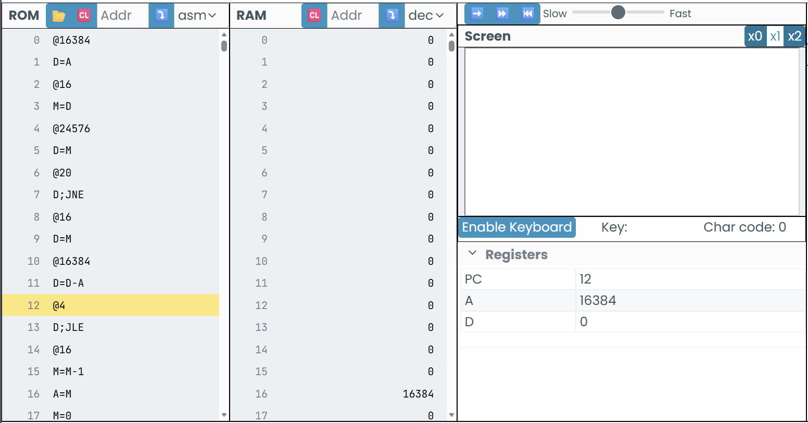
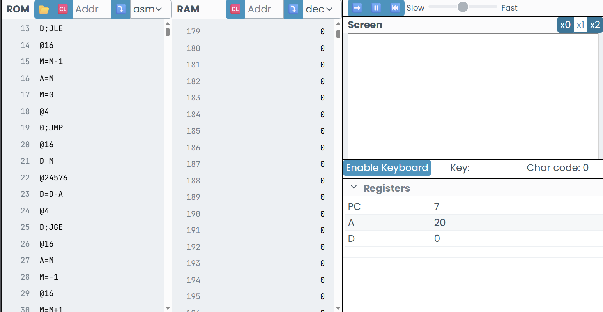

# ACTIVIDAD 2
- 1 .Lo que sucede al ejecutar el programa es que:
     - La CPU lee las instrucciones desde la ROM.
     - coge los registros A y D, y realiza una operacion matematica.
     - Guarda el resultado final en la RAM.
       
 ---
       
 - 2 INICIÉ IDENTIFICANDO QUE NÚMERO SE GUARDABA AL LLEGAR A  LA MEMORIA 16 Y LLEGUÉ A LA CONCLUSION DE QUE ES EL NÚMERO 3 TAL Y COMO SE EVIDENCIAS EN LA IMAGEN.


---

- 3 Este numero resulta porque en D almacena un resultado temporal de la operacion de A y D, luego el valor se copia en la memoria 16.


  ---
  
- 4
# Fetch:
  la CPU lee la instruccion que se encuentra en la ROM usando el contador del programa.
  # Decode:
  el programa identifica que tipo de intruccion es... A o C
   **A(@valor)  o   C(D=A, D=D+A, etc)**
  # Execute:
  ejecuta la operacion: **carga un valor, hace operaciones o guarda en memoria**

---
  
  - 5 - Registro a: cambia cuando se usan instrucciones de el mismo... **A(@valor)**
      - Almacenamiento D: almacena resultados y datos rapidos dependiendo del contador o de lo que le indiquemos.
      - RAM: cambia cuando el programa escribe en ella o la llama.

---

## Cambios Observados en Registros y Memoria
- El *registro A* cambia cuando se cargan direcciones o valores constantes.
- El *registro D* almacena los resultados de las operaciones aritméticas.
- La *RAM* almacena los resultados finales del programa.

---

## Resultado del Experimento
- El programa realiza una suma de los numeros 5 y 10.
- El resultado se almacena correctamente en la dirección de memoria indicada (20).
- El valor almacenado en la RAM corresponde al resultado de la operación ejecutada.

---


---
## Diferencia entre Memoria ROM y RAM

| ROM | RAM |
|-----|-----|
| Almacena el programa | Almacena los datos |
| No cambia durante la ejecución | Cambia durante la ejecución |
| Contiene instrucciones | Contiene resultados |

---

## Conclusión
La CPU Hack ejecuta instrucciones de manera secuencial y controlada.  
La ROM define el comportamiento del programa y la RAM refleja los resultados de su ejecución.  
Comprender el ciclo Fetch–Decode–Execute permite entender cómo funciona un procesador a bajo nivel.

# ACTIVIDAD 3
En esta primera parte del código supe identificar que era lo que ejecutaba cada indicación dentro del programa.


---
En esta parte del código creí que se iba a almacenar en la ram el número qque estaba en D pero no fué así, y me perdí un poco.


---
Mi confusión siguió hasta la la línea de código 9, en la línea 10 y 11, ya supe nuevamente que era lo que iba a ejecutar el código y el resultado que me iba a arrojar.


---
En esta parte del código estuve un poco perdido porque pensé ue la instrucción JGE iba a almacenar algo o a realizar alguna operación, pero en cambio repitió el programa como un bucle, lo que me lleva  a la pregunta... Por qué hay más código después si no se está usando.

  
---

  ## Reporte actividad 3
  1. Una instrucción que usa `ALU` es: **D=D-A**
Esta instrucción realiza una *resta* entre el valor que está en el registro **D** y el valor del registro **A**.  
La `ALU` se encarga de hacer esta operación matemática y guarda el resultado en **D**.  
En el programa se utiliza para comparar direcciones de memoria, como cuando se revisan los límites de `SCREEN` o `KBD`.   

2.  **¿Para qué sirve el registro PC?:** 
El `PC` **(Program Counter)** sirve para indicar qué instrucción se va a ejecutar a continuación.  
Después de ejecutar una instrucción, el PC avanza automáticamente.  
Cuando hay saltos **(`JMP`, `JGE`, `JNE`, etc.)**, el PC cambia su valor y permite que el programa vaya a otra parte del código, como un bucle.

3.  Diferencia entre **@i** y **@READKEYBOARD**.
- `@i` es una **variable** que guarda una dirección de memoria y se usa como contador para recorrer la pantalla.
- `@READKEYBOARD` es una **etiqueta**, no guarda datos. Sirve para marcar una parte del programa y poder saltar a ella.

4. **¿Qué se necesita para leer el teclado y mostrar información en la pantalla?:** 
Para leer el teclado y mostrar información en la pantalla se necesita:
- Leer el valor del teclado usando:
   1. KBD
   2. D=M
- Evaluar si una tecla está presionada usando una condición (JNE, JGE, etc.).
- Usar la dirección de SCREEN junto con una variable como i para decidir dónde escribir.
- Escribir en memoria:
  1. M = -1 para encender píxeles
   2. M = 0 para borrar píxeles

Este proceso se repite constantemente para que el programa responda en tiempo real al teclado.
 
5. Un bucle claro es:
```
 (READKEYBOARD)
 ...
 @READKEYBOARD
 0; JNE
  ```
  Este bucle hace que el programa revise constantemente el teclado. Nunca se detiene, lo que permite que el sistema reaccione en tiempo real cuando una tecla se presiona o se suelta.

6. Una condición importante es:
```
@KBD
D=M
@KEYPRESSED
D; JNE
```
Aquí el programa verifica si el valor leído del teclado es diferente de cero.
- Si no es cero, significa que hay una tecla presionada y se salta a KEYPRESSED.
- Si es cero, continúa ejecutando el código normal.

Esta condición permite decidir si se debe dibujar o borrar en la pantalla.

---
# Actividad 4
Código
```jv
@5 
D=M 
@10 
D=D-A 
@12 
D;JLT 
@0 
D=A 
@7 
M=D 
@16 
0;JMP 
@1 
D=A 
@7 
M=D 
```
### Demostración funcionabilidad numero menor a 10.


### Demostración funcionabilidad número mayor a 10


**intento #1**

usé D=A-D en vez de D=D-A y el programa no comparaba correctamente si RAM[5] es menor que 10.


**intento #2**

utilicé JGT (mayor que cero) en lugar de JLT, osea que el programa estuvo ejecutando el if cuando RAM[5] sea mayor que 10, no menor, por lo cual el resultado almacenado en 7 se invirtió.


**Observaciones**
- En los 3 intentos que hice la solución la guió la ia pero no se hizo en su totalidad, solo en las lineas que marcaban error  

- Al ejecutar el programa, se nota que primero se carga el valor de RAM[5] y se le resta 10.

- La instrucción D;JLT hace que el programa tome una decisión dependiendo del resultado de la resta.

- Cuando la condición se cumple, el programa salta directamente a la parte donde se guarda el valor 1.

- Cuando no se cumple, guarda el valor 0 y luego salta al final del programa.

- El salto incondicional evita que se ejecuten instrucciones que no corresponden.

```
Este ejercicio me ayudó a entender cómo se puede representar una estructura if–else usando lenguaje ensamblador. Aprendí que el orden de las instrucciones es muy importante y que los saltos controlan el flujo del programa. Aunque el código es corto, cada línea cumple una función específica y si una sola instrucción estuviera mal, el resultado final cambiaría completamente. Este programa me ayudó a comprender mejor cómo la computadora toma decisiones usando comparaciones simples.
```

# Actividad 5


# Actividad 6
1. Fases Fetch–Decode–Execute y rol del PC

- Fetch: la CPU va a buscar la instrucción a la memoria usando el Program Counter.

- Decode: la CPU interpreta qué instrucción es y qué debe hacer.

- Execute: se ejecuta la instrucción (cálculo, guardar datos, saltar, etc.).
- El Program Counter (PC) guarda la dirección de la siguiente instrucción que se va a ejecutar y normalmente se incrementa, a menos que haya un salto.

2. Diferencia entre instrucción-A e instrucción-C

- Una instrucción-A empieza con @ y sirve para cargar un valor o una dirección en el registro A.

Ejemplo: @10

- Una instrucción-C sirve para hacer cálculos, asignaciones o saltos usando registros como D, A o M.

Ejemplo: D=M

3. Función de los componentes

- Registro D: guarda datos temporales para cálculos.

- Registro A: guarda direcciones de memoria o valores constantes.

- ALU: hace las operaciones matemáticas y lógicas (sumar, restar, comparar, etc.).

4. Salto condicional en Hack:
Se hace con una instrucción-C que incluye una condición de salto.
Ejemplo: si quiero saltar cuando D > 0:
```
@ETIQUETA
D;JGT
```
Si D es mayor que cero, el programa salta a ETIQUETA.

5. Implementación de un loop:
Un loop se hace usando una etiqueta y un salto condicional o incondicional.
Ejemplo: decrementar un valor hasta que llegue a cero:
```
(LOOP)
D=D-1
@LOOP
D;JGT
```
6. Diferencia entre D=M y M=D

- D=M: copia el valor de la memoria a D.

- M=D: guarda el valor de D en la memoria.

7. Leer del teclado y pintar en la pantalla

- Para leer el teclado se accede a la dirección KBD, que tiene el valor de la tecla presionada.

- Para pintar en la pantalla se escribe un valor en una dirección de SCREEN, que controla los píxeles.

### 2: reflexión (metacognición)

1. Concepto más desafiante
Los saltos y los loops, porque al inicio me confundía cuándo el programa realmente saltaba y cuándo no.

2. Metodología más útil
Cuando predecía qué iba a pasar antes de ejecutar el código y luego veía que el resultado era diferente. Eso me ayudó a entender mis errores.

3. Momento “¡Aha!”
Cuando entendí que A no solo guarda números, sino direcciones de memoria. Eso aclaró muchas instrucciones.

4. Qué haré diferente en la próxima unidad
Practicar más desde el inicio y probar pequeños ejemplos en lugar de esperar a entender todo de una sola vez.


