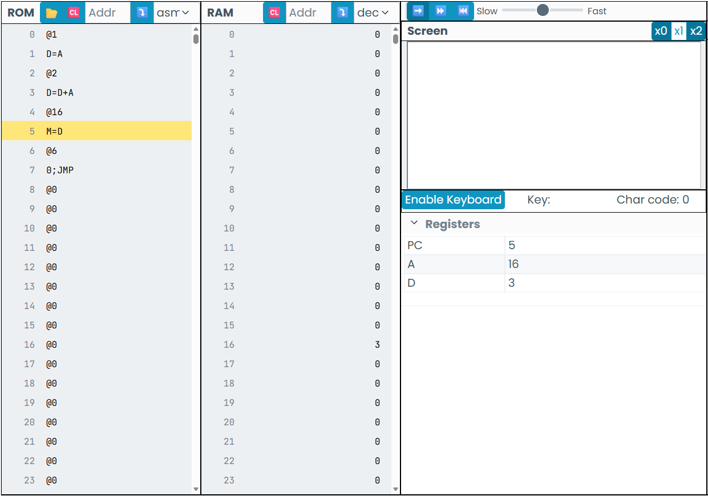

# ACTIVIDAD 2
- 1 .Lo que sucede al ejecutar el programa es que:
     - La CPU lee las instrucciones desde la ROM.
     - coge los registros A y D, y realiza una operacion matematica.
     - Guarda el resultado final en la RAM.
       
 ---
       
 - 2 INICIÉ IDENTIFICANDO QUE NÚMERO SE GUARDABA AL LLEGAR A  LA MEMORIA 16 Y LLEGUÉ A LA CONCLUSION DE QUE ES EL NÚMERO 3 TAL Y COMO SE EVIDENCIAS EN LA IMAGEN.

---

- 3 Este numero resulta porque en D almacena un resultado temporal de la operacion de A y D, luego el valor se copia en la memoria 16.

  ---
  
- 4
# Fetch:
  la CPU lee la instruccion que se encuentra en la ROM usando el contador del programa.
  # Decode:
  el programa identifica que tipo de intruccion es... A o C
   **A(@valor)  o   C(D=A, D=D+A, etc)**
  # Execute:
  ejecuta la operacion: **carga un valor, hace operaciones o guarda en memoria**

---
  
  - 5 - Registro a: cambia cuando se usan instrucciones de el mismo... **A(@valor)**
      - Almacenamiento D: almacena resultados y datos rapidos dependiendo del contador o de lo que le indiquemos.
      - RAM: cambia cuando el programa escribe en ella o la llama.

---

## Cambios Observados en Registros y Memoria
- El *registro A* cambia cuando se cargan direcciones o valores constantes.
- El *registro D* almacena los resultados de las operaciones aritméticas.
- La *RAM* almacena los resultados finales del programa.

---

## Resultado del Experimento
- El programa realiza una suma de los numeros 5 y 10.
- El resultado se almacena correctamente en la dirección de memoria indicada (20).
- El valor almacenado en la RAM corresponde al resultado de la operación ejecutada.

---

---
## Diferencia entre Memoria ROM y RAM

| ROM | RAM |
|-----|-----|
| Almacena el programa | Almacena los datos |
| No cambia durante la ejecución | Cambia durante la ejecución |
| Contiene instrucciones | Contiene resultados |

---

## Conclusión
La CPU Hack ejecuta instrucciones de manera secuencial y controlada.  
La ROM define el comportamiento del programa y la RAM refleja los resultados de su ejecución.  
Comprender el ciclo Fetch–Decode–Execute permite entender cómo funciona un procesador a bajo nivel.

# ACTIVIDAD 3
En esta primera parte del código supe identificar que era lo que ejecutaba cada indicación dentro del programa.

En esta parte del código creí que se iba a almacenar en la ram el número qque estaba en D pero no fué así, y me perdí un poco.

Mi confusión siguió hasta la la línea de código 9, en la línea 10 y 11, ya supe nuevamente que era lo que iba a ejecutar el código y el resultado que me iba a arrojar.

En esta parte del código estuve un poco perdido porque pensé ue la instrucción JGE iba a almacenar algo o a realizar alguna operación, pero en cambio repitió el programa como un bucle, lo que me lleva  a la pregunta... Por qué hay más código después si no se está usando.

  

  ## Reporte actividad 3
  1. Una instrucción que usa ALU es: **D=D-A**
Esta instrucción realiza una *resta* entre el valor que está en el registro D y el valor del registro A.  
La ALU se encarga de hacer esta operación matemática y guarda el resultado en D.  
En el programa se utiliza para comparar direcciones de memoria, como cuando se revisan los límites de SCREEN o KBD.