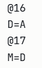

# ACTIVIDAD 1
## Código act1 ensamblador
```As
@16384     
D=A    
@0     
A=D  
M=1 
0;JMP 
```

## Código act1 c++
```c++
class Program
{
    static void Main()
    {
        int[] RAM = new int[32768]; 
        int A = 16384;
        int D = A;
        A = 0;
        A = D;
        RAM[A] = 1;
        while (true)
        {
    
        }
        
        Console.WriteLine($"Valor escrito en RAM[{16384}] = {RAM[16384]}");
    }
}
```
## programa funiconal
Programa funcional sin errores, la guía fué clara por lo que se solucionó sin hacer pruebas.


# ACTIVIDAD 2
## Código act2 ensamblador
```As
@16384 
D=A 
@0 
A=D 
M=-1 
0;JMP 
```
## Código act2 c++
```c++
int main() {

    int RAM[32768] = {0}; 

    int A = 0;

    int D = 0;

    A = 16384;

    D = A;

    A = 0;

    A = D;

    RAM[A] = -1;
    
    cout << "✓ Valor escrito en RAM[" << A << "] = " << RAM[A] << endl;
    
    return 0;
}
```
Primera y última predicción, supuse que guardando 15 en A y sumandole después 1 se iba a formar la línea por la cantidad de pixeles. 


### Programa funcional


# ACTIVIDAD 3
## Código act3 ensamblador

```As
@20000
D=A
@0
M=D         

@0
A=M
M=-1

(LOOP)
   
    @24576
    D=M
    
    @LOOP
    D;JEQ
    
    @1
    M=D
    

    @100
    D=D-A
    @MOVER_D
    D;JEQ
    

    @1
    D=M
    @105
    D=D-A
    @MOVER_I
    D;JEQ
    
    @LOOP
    0;JMP

```
## Código act3 c++

```C++
using namespace std;

int main() {
    
    int RAM[32768] = {0};      
    const int SCREEN_START = 16384;  
    const int KEYBOARD = 24576;      
    
    int A = 0;
    int D = 0;

    D = SCREEN_START;
    RAM[0] = D;
    
    A = RAM[0];
    RAM[A] = -1;
    
    cout << "=== Simulador de Línea Horizontal ===" << endl;
    cout << "Presiona 'd' para mover a la DERECHA" << endl;
    cout << "Presiona 'i' para mover a la IZQUIERDA" << endl;
    cout << "Presiona 'q' para SALIR" << endl;
    cout << "\nPosición inicial: " << RAM[0] << endl;
    cout << "RAM[" << RAM[0] << "] = " << RAM[RAM[0]] << "\n" << endl;
    
    while (true) {
    
        if (_kbhit()) {
            char tecla = _getch();
            
            D = (int)tecla;
            
            if (tecla == 'q' || tecla == 'Q') {
                cout << "\n¡Programa terminado!" << endl;
                break;
            }
            
            RAM[1] = D;
            
            D = D - 100;
            if (D == 0) {

                A = RAM[0];
                RAM[A] = 0;
                
                RAM[0] = RAM[0] + 1;
                
                A = RAM[0];
                RAM[A] = -1;
                
                cout << "→ DERECHA | Posición: " << RAM[0] 
                     << " | RAM[" << RAM[0] << "] = " << RAM[RAM[0]] << endl;
                
                while (_kbhit()) {
                    _getch();
                }
                Sleep(150);
                continue;
            }
            
            D = RAM[1];
            D = D - 105;
            if (D == 0) {

                A = RAM[0];
                RAM[A] = 0;
                
                RAM[0] = RAM[0] - 1;
                

                A = RAM[0];
                RAM[A] = -1;
                
                cout << "← IZQUIERDA | Posición: " << RAM[0] 
                     << " | RAM[" << RAM[0] << "] = " << RAM[RAM[0]] << endl;
                
                while (_kbhit()) {
                    _getch(); 
                }
                Sleep(150);
                continue;
            }
        }
    }
    
    return 0;
}

```
Programa definitivo funcional


Predicciones
- 1. La línea debería borrarse de RAM[16384] y aparecer en RAM[16385].


Observar: La línea se movió correctamente.

Reflexión: El orden es crítico: primero borrar, luego incrementar, luego dibujar.

- 2. Al presionar 'i', debería moverse a la izquierda.


Predicción: Al presionar 'i', D = 0 después de la resta.

Ejecución: D = -5 

Observación: ¡El salto NO ocurre!

Reflexión: ERROR, D ya había sido modificado en la comparación anterior con 'd'. 

Necesito volver a leer RAM[24576] o usar RAM[1].

- 3. borrador con lo necesario para mover con cualquier tecla  la derecha.


# actividad 4

```As
M=0       


M=1      

D=M        
@100
D=D-A    

D;JGT     

D=M        
@sum
M=D+M  

@i
M=M+1   

0;JMP      

@FOR_END
0;JMP 
```
**CONCLUSIONES**
- El ciclo for y el ciclo while son equivalentes a nivel lógico.

- En ensamblador no existen estructuras de alto nivel como for o while.

- Ambos ciclos se traducen a la misma estructura basada en etiquetas y saltos condicionales.

- La diferencia entre for y while es solo sintáctica en lenguajes de alto nivel.

- En bajo nivel, todo se reduce a comparaciones y saltos.
# actividad 5
## traducción programa 1.
```As
@10
D=A
@16        
M=D       
@16        
D=A        
M=D        

@20
D=A        
@17        
A=M        
M=D      
(END)
@END
0;JMP 

```
### Paso a paso
- PASO 1: Crear variable a = 10

PREDICCIÓN: La variable a debe valer 10

EJECUCIÓN:


OBSERVACIÓN:

RAM[16] = 10 

REFLEXION: La variable a está en la dirección de memoria 16 y contiene el valor 10.

- PASO 2: Hacer que p apunte a a (p = &a)

PREDICCIÓN: El puntero p debe guardar el número 16 (que es la dirección donde está a)

EJECUCIÓN:



OBSERVACIÓN:

RAM[16] = 10 (la variable a)

RAM[17] = 16 (el puntero p contiene "16")

REFLEXIÓN:

Usamos D=A porque queremos la DIRECCIÓN (16), no el contenido (10)
El puntero p ahora "apunta" a a porque contiene su dirección


- PASO 3: Modificar a través del puntero (*p = 20)

PREDICCIÓN: La variable a debe cambiar de 10 a 20

EJECUCIÓN:


OBSERVACIÓN:

RAM[16] = 20  (cambió de 10 a 20)

RAM[17] = 16 (el puntero sigue igual)

REFLEXIÓN:

A=M es la INDIRECCIÓN: lee el puntero (16) y lo usa como dirección

Modificamos a sin tocarla directamente, usando el puntero p

## traducción programa 2.
```As
@10
D=A
@16
M=D

@5
D=A
@17
M=D

@16
D=A
@18
M=D


@18
A=M
D=M
@17
M=D

(END)
@END
0;JMP
```
### Paso a paso
- PASO 1: Crear variable a = 10

PREDICCIÓN: La variable a debe valer 10

EJECUCIÓN:


OBSERVACIÓN: RAM[16] = 10 

REFLEXIÓN: La variable a está en la dirección de memoria 16 y contiene el valor 10.

- PASO 2: Crear variable b = 5

PREDICCIÓN: La variable b debe valer 5

EJECUCIÓN:


OBSERVACIÓN:

RAM[16] = 10 (la variable a)
RAM[17] = 5 (la variable b)

REFLEXIÓN: Ahora tenemos dos variables: a en RAM[16] y b en RAM[17].

- PASO 3: Hacer que p apunte a a (p = &a)

PREDICCIÓN: El puntero p debe guardar el número 16 (que es la dirección donde está a)

EJECUCIÓN:


OBSERVACIÓN:

RAM[16] = 10 (la variable a)
RAM[17] = 5 (la variable b)
RAM[18] = 16 (el puntero p contiene "16")

REFLEXIÓN: Usamos D=A porque queremos la DIRECCIÓN (16), no el contenido (10) y el puntero p ahora "apunta" a a porque contiene su dirección.


- PASO 4: Leer a través del puntero (b = *p)

PREDICCIÓN: La variable b debe cambiar de 5 a 10 (copiando el valor de a)

EJECUCIÓN:


OBSERVACIÓN:

RAM[16] = 10 (la variable a sigue igual)
RAM[17] = 10 (b cambió de 5 a 10)
RAM[18] = 16 (el puntero sigue igual)

REFLEXIÓN:

A=M es la INDIRECCIÓN: lee el puntero (16) y lo usa como dirección

D=M lee el contenido de la dirección apuntada (lee el valor de a) y copiamos el valor de a a b usando el puntero p

# actividad 6
PRUEBA 1: Inicializar el arreglo en memoria

Característica implementada: guardar datos consecutivos desde RAM[16].
```
@16
M=1
@17
M=2
@18
M=3
@19
M=4
@20
M=5
@21
M=6
@22
M=7
@23
M=8
@24
M=9
@25
M=10
```

Cómo lo comprobé:
Ejecuté paso a paso en el simulador y verifiqué que las posiciones 16–25 contuvieran los valores correctos.

PRUEBA 2: Inicializar variables

Necesitamos:

- `sum`
- `ptr (puntero al arreglo)`
- `j`


```
@sum
M=0

@j
M=0

@ptr
M=16  
```
Cómo lo comprobé:
Verifiqué que:

- sum = `0`

- j = `0`

- ptr = `16`

PRUEBA 3: Acceder a arr [j] usando puntero

Idea:
```
dirección = ptr + j
```

En Hack:
```
@ptr
D=M       

@j
A=D+M     

D=M        
```
Cómo comprobé:
comprobé con `j = 0`, luego `j = 1`, y verifiqué que `D` tomara los valores correctos del arreglo.

# Actividad 7: Autoevaluación
**Mirando hacia adentro: autoevaluación de conceptos y proceso**
1. ¿Cómo se representa y manipula un puntero en el lenguaje ensamblador de Hack?

En el lenguaje ensamblador de Hack, un puntero es simplemente una variable que almacena una dirección de memoria. No existe un tipo especial llamado "puntero"; es una posición de memoria que guarda otra dirección.

**Operación equivalente a** `p = &a`

Significa guardar la dirección de la variable `a` dentro de `p`.

En ensamblador:

```asm
@a
D=A     
@p
M=D      
```
Aquí se usa A para obtener la dirección simbólica de a, y luego se guarda en p.

**Operación equivalente a** `p = 20`

Significa escribir el valor 20 en la dirección almacenada en p.
```

@20
D=A
@p
A=M      
M=D      

```
Primero se carga 20 en el registro D. Luego se cambia el registro A para que apunte a la dirección contenida en p, y finalmente se escribe el valor en esa dirección.

2. ¿Cómo implementarías el acceso a un elemento de un arreglo como arr [j]?

Para acceder a arr [j] en ensamblador se necesitan dos elementos:

- La dirección base del arreglo.

- El índice j.

El acceso se realiza sumando la dirección base con el índice:
```
dirección = base + j
```

En ensamblador:
```
@base
D=M       

@j
A=D+M      

D=M        
```

La dirección base indica dónde comienza el arreglo en memoria. El índice j indica cuántas posiciones desplazarse desde esa base.

**Parte 2: Reflexión sobre el proceso (Metacognición)**

**1. ¿Cuál fue el concepto más abstracto o difícil de traducir de C++ a ensamblador?**

El concepto más difícil fue el de punteros, porque obligan a pensar en direcciones de memoria en lugar de valores. En C++ el uso de punteros parece simple, pero en ensamblador se debe manipular explícitamente la dirección almacenada.

Para entenderlo, fue útil dibujar la memoria como una tabla, seguir los valores paso a paso en el simulador y probar ejemplos pequeños antes de construir el programa completo.

---

**2. ¿Cómo ayudó construir el programa paso a paso mediante pruebas?**

Trabajar paso a paso permitió reducir la complejidad. Primero se probó la inicialización del arreglo, luego las variables, después el acceso con punteros y finalmente el ciclo completo.

Este enfoque ayudó a detectar errores rápidamente y a entender exactamente qué hacía cada bloque de código antes de continuar con el siguiente.

---

**3. ¿Qué concepto de bajo nivel te sientes más seguro de identificar cuando lo veas implementado en C++?**

Ahora es más fácil identificar en C++:

- Que un arreglo es memoria contigua.
- Que `arr[j]` es realmente aritmética de direcciones.
- Que los ciclos `for` y `while` se convierten en comparaciones y saltos.
- Que los punteros son variables que almacenan direcciones.

Esto permite entender mejor qué ocurre internamente cuando se ejecuta un programa en un lenguaje de alto nivel.
