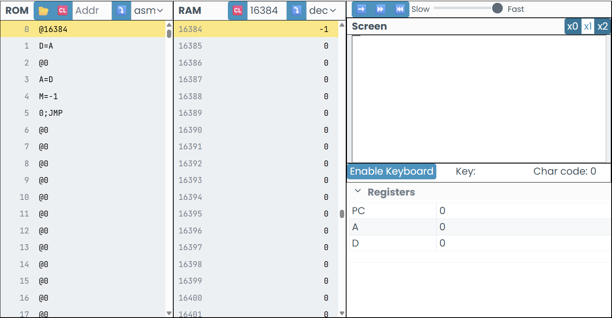

# ACTIVIDAD 1
## Código act1 ensamblador
```As
@16384     
D=A    
@0     
A=D  
M=1 
0;JMP 
```

## Código act1 c++
```c++
class Program
{
    static void Main()
    {
        int[] RAM = new int[32768]; 
        int A = 16384;
        int D = A;
        A = 0;
        A = D;
        RAM[A] = 1;
        while (true)
        {
    
        }
        
        Console.WriteLine($"Valor escrito en RAM[{16384}] = {RAM[16384]}");
    }
}
```
Programa funcional sin errores, la guía fué clara por lo que se solucionó sin hacer pruebas.


# ACTIVIDAD 2
## Código act2 ensamblador
```As
@16384 
D=A 
@0 
A=D 
M=-1 
0;JMP 
```
## Código act2 c++
```c++
int main() {

    int RAM[32768] = {0}; 

    int A = 0;

    int D = 0;

    A = 16384;

    D = A;

    A = 0;

    A = D;

    RAM[A] = -1;
    
    cout << "✓ Valor escrito en RAM[" << A << "] = " << RAM[A] << endl;
    
    return 0;
}
```
Primera y última predicción, supuse que guardando 15 en A y sumandole después 1 se iba a formar la línea por la cantidad de pixeles. 


Programa funcional


# ACTIVIDAD 3
## Código act3 ensamblador

```As
@16384
D=A
@0
M=D         

@0
A=M
M=-1

(LOOP)
   
    @24576
    D=M
    
    @LOOP
    D;JEQ
    
    @1
    M=D
    

    @100
    D=D-A
    @MOVER_D
    D;JEQ
    

    @1
    D=M
    @105
    D=D-A
    @MOVER_I
    D;JEQ
    
    @LOOP
    0;JMP

```
## Código act3 c++

```C++
using namespace std;

int main() {
    
    int RAM[32768] = {0};      
    const int SCREEN_START = 16384;  
    const int KEYBOARD = 24576;      
    
    int A = 0;
    int D = 0;

    D = SCREEN_START;
    RAM[0] = D;
    
    A = RAM[0];
    RAM[A] = -1;
    
    cout << "=== Simulador de Línea Horizontal ===" << endl;
    cout << "Presiona 'd' para mover a la DERECHA" << endl;
    cout << "Presiona 'i' para mover a la IZQUIERDA" << endl;
    cout << "Presiona 'q' para SALIR" << endl;
    cout << "\nPosición inicial: " << RAM[0] << endl;
    cout << "RAM[" << RAM[0] << "] = " << RAM[RAM[0]] << "\n" << endl;
    
    while (true) {
    
        if (_kbhit()) {
            char tecla = _getch();
            
            D = (int)tecla;
            
            if (tecla == 'q' || tecla == 'Q') {
                cout << "\n¡Programa terminado!" << endl;
                break;
            }
            
            RAM[1] = D;
            
            D = D - 100;
            if (D == 0) {

                A = RAM[0];
                RAM[A] = 0;
                
                RAM[0] = RAM[0] + 1;
                
                A = RAM[0];
                RAM[A] = -1;
                
                cout << "→ DERECHA | Posición: " << RAM[0] 
                     << " | RAM[" << RAM[0] << "] = " << RAM[RAM[0]] << endl;
                
                while (_kbhit()) {
                    _getch();
                }
                Sleep(150);
                continue;
            }
            
            D = RAM[1];
            D = D - 105;
            if (D == 0) {

                A = RAM[0];
                RAM[A] = 0;
                
                RAM[0] = RAM[0] - 1;
                

                A = RAM[0];
                RAM[A] = -1;
                
                cout << "← IZQUIERDA | Posición: " << RAM[0] 
                     << " | RAM[" << RAM[0] << "] = " << RAM[RAM[0]] << endl;
                
                while (_kbhit()) {
                    _getch(); 
                }
                Sleep(150);
                continue;
            }
        }
    }
    
    return 0;
}

```
Predicciones
- 1. La línea debería borrarse de RAM[16384] y aparecer en RAM[16385].


Observar: La línea se movió correctamente.

Reflexión: El orden es crítico: primero borrar, luego incrementar, luego dibujar.

- 2. Al presionar 'i', debería moverse a la izquierda.


Predicción: Al presionar 'i', D = 0 después de la resta.

Ejecución: D = -5 

Observación: ¡El salto NO ocurre!

Reflexión: ERROR, D ya había sido modificado en la comparación anterior con 'd'. 

Necesito volver a leer RAM[24576] o usar RAM[1].

- 3. borrador con lo necesario para mover con cualquier tecla  la derecha.


