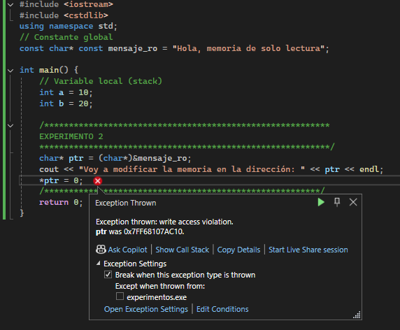
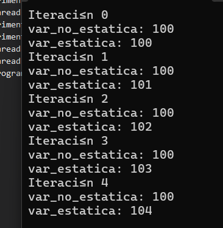
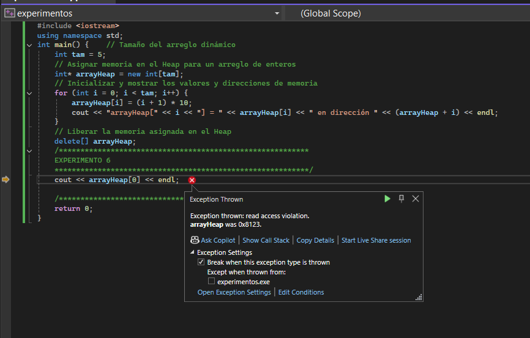

# Actividad 4
### Experimento 1
```C++
#include <iostream>
#include <cstdlib>
using namespace std;

int main() {    
		// Variable local (stack)    
		int a = 10;    
		int b = 20;
    /**********************************************************        
    EXPERIMENTO 1    
    ***********************************************************/
    void* ptr = reinterpret_cast<void*>(&main);    
    cout << "Voy a modificar la memoria en la dirección: " << ptr << endl;    
    *reinterpret_cast<int*>(ptr) = 0;
    /********************************************************/
    return 0;
    }

```
El experimento compila pero automaticamente deja de funcionar porque en la linea ` *reinterpret_cast<int*>(ptr) = 0;`, el sistema operativo detecta que se está escribiendo en una zona que es solamente  de lectura y termina el programa.


### Experimento 2
```C++
#include <iostream>
#include <cstdlib>
using namespace std;
// Constante global
const char* const mensaje_ro = "Hola, memoria de solo lectura";

int main() {    
		// Variable local (stack)    
		int a = 10;    
		int b = 20;

    /**********************************************************        
    EXPERIMENTO 2    
    ***********************************************************/
    char* ptr = (char*)&mensaje_ro;    
    cout << "Voy a modificar la memoria en la dirección: " << ptr << endl;    
    *ptr = 0;
    /********************************************************/
    return 0;
    }
```
El string `"Hola, memoria de solo lectura"` se guarda en memoria de solo lectura.
Aunque se haga un cast a `char`, sigue siendo memoria protegida.




### Experimento 3
```C++
#include <iostream>
#include <cstdlib>
using namespace std;
// Variables globales
int global_inicializada = 42;
int global_no_inicializada;

int main() {    // Variable local (stack)    
		int a = 10;    
		int b = 20;
    /**********************************************************        
    EXPERIMENTO 3    
    ***********************************************************/
    cout << "global_inicializada: " << global_inicializada << endl;    
    cout << "global_no_inicializada: " << global_no_inicializada << endl;

    global_inicializada = 69;    
    global_no_inicializada = 666;
    cout << "global_inicializada: " << global_inicializada << endl;    
    cout << "global_no_inicializada: " << global_no_inicializada << endl;
    /********************************************************/
    return 0;
    }

```
El programa funciona normalmente y los valores cambian.

- `global_inicializada` empieza en **42** → luego **69**

- `global_no_inicializada` empieza en **0** → luego **666**


Por qué:
Las variables globales están en el segmento de datos, que sí es modificable.

- **Inicializadas** → segmento `.data`

- **No inicializadas** → segmento `.bss`


### Experimento 4
```C++
#include <iostream>
#include <cstdlib>
using namespace std;
// Función de ejemplo que muestra la dirección de su variable local estática
void funcionConStatic() {    
		static int var_estatica = 100;    
		cout << "Dirección de var_estatica (static): " << &var_estatica << endl;
}

int main() {    // Variable local (stack)    
		int a = 10;    
		int b = 20;
    /**********************************************************        
    EXPERIMENTO 4    
    ***********************************************************/
    var_estatica = 42;
    cout << "var_estatica: " << var_estatica << endl;
    /********************************************************/    
    return 0;
    }

```
El código no compila.


Por que `var_estatica` existe solo dentro de la función.
Aunque sea `static`, su alcance sigue siendo local.

**No se puede acceder a ella desde main.**


---
¿Qué pasa con las variables cada que entras y sales de la función?

Las variables locales normales, se crean al entrar y se destruyen al salir.

**Su valor no se conserva.**

---
¿Qué pasa con las variables locales estáticas?

- Se crean una sola vez.

- Mantienen su valor entre llamados.

- Viven en el segmento de datos, no en el stack.

### Experimento 5
```C++
#include <iostream>
#include <cstdlib>
using namespace std;
// Función de ejemplo que muestra la dirección de su variable local estática
void funcionConStatic() {    
		static int var_estatica = 100;    
		cout << "var_estatica: " << var_estatica << endl;    
		var_estatica++;
}
		
void funcionSinStatic() {    
		int var_no_estatica = 100;    
		cout << "var_no_estatica: " << var_no_estatica << endl;    
		var_no_estatica++;
}

int main() {    // Variable local (stack)    
		int a = 10;    
		int b = 20;
    /**********************************************************        
    EXPERIMENTO 5    
    ***********************************************************/
    for (int i = 0; i < 5; i++) {        
		    cout << "Iteración " << i << endl;        
		    funcionSinStatic();        
		    funcionConStatic();    
		}
    /********************************************************/
    return 0;
    }

```
En cada iteración del ciclo:

- `var_no_estatica` siempre imprime **100**.
- `var_estatica` aumenta en cada llamada: **100, 101, 102, 103…**



Esto ocurre porque:

- La variable local normal se crea y destruye cada vez que se llama la función, por lo que siempre vuelve a 100.
- La variable local `static` se crea una sola vez y conserva su valor entre llamadas.

---

### Experimento 6
```C++
#include <iostream>
using namespace std;
int main() {    // Tamaño del arreglo dinámico    
		int tam = 5;
    // Asignar memoria en el Heap para un arreglo de enteros    
    int* arrayHeap = new int[tam];
    // Inicializar y mostrar los valores y direcciones de memoria    
    for (int i = 0; i < tam; i++) {        
		    arrayHeap[i] = (i + 1) * 10;        
		    cout << "arrayHeap[" << i << "] = " << arrayHeap[i] << " en dirección " << (arrayHeap + i) << endl;    
		    }
    // Liberar la memoria asignada en el Heap    
    delete[] arrayHeap;
    /**********************************************************        
    EXPERIMENTO 6    
    ***********************************************************/
    cout << arrayHeap[0] << endl;

    /********************************************************/
    return 0;
    }

```
Después de `delete[] arrayHeap`, acceder a `arrayHeap[0]` es comportamiento indefinido.

Se puede:

- Imprimir cosas innecesarias

- Funcionar por casualidad

- Crashear

Por que se liberó la memoria. Entonces el puntero queda apuntando a un lugar que ya no es de nuestro dominio.


---
 Esta es la línea que genera error `cout << arrayHeap[0] << endl;`
  Diferencias Heap vs Stack

---

| Stack        | Heap           |
|--------------|---------------|
| Automático   | Manual        |
| Rápido       | Más lento     |
| Tamaño limitado | Más grande |
| Se limpia solo | Debes liberar |

---
Consecuencias de no liberar memoria

**Memory leak**

- El programa consume memoria sin devolverla  
- Puede volverse lento o crashear  

---
¿Por qué usar `delete[]` para arreglos?

Porque el compilador necesita saber que liberas varios elementos.

- `delete` → un objeto  
- `delete[]` → arreglo  

Si usas el incorrecto → **comportamiento indefinido**

