# Actividad 1
## Parte 1: recordando los conceptos (en C#)
### **1. ¿Qué es el encapsulamiento para ti?**

**Respuesta:** Es la seguridad en el acceso a los datos del objeto, esta puede ser: `Pública` `Privada` o `Protegida`, la unica manera en la que se tiene acceso al atributo encapsulado es con sus propios metodos los cuales son `getters` y `setters`.

- **Getters** → permiten **obtener** el valor de un atributo.
- **Setters** → permiten **modificar** el valor de un atributo.


**1.1. Describe una situación en la que te haya sido útil o donde hayas visto su importancia.**

**Respuesta:** Situación donde se ve la importancia del encapsulamiento

En un proyecto que hice en programación, me di cuenta de la importancia del **encapsulamiento** cuando estaba trabajando con clases que tenían atributos que no deberían modificarse directamente.

Por ejemplo, si tengo una clase que representa una **cuenta bancaria**, el saldo no debería poder cambiarse desde cualquier parte del programa, porque alguien podría asignarle cualquier valor, incluso uno negativo. Por eso, el saldo se puede mantener como un **atributo privado** y solo permitir que se modifique mediante métodos como `depositar()` o `retirar()`.

De esta forma, el programa controla cómo se modifican los datos y evita errores.

### **2. ¿Qué es la herencia?**

**Respuesta:** Es la **transferencia de metodos y atributos** que reciben las `clase hijas` de la `clase padre` por lo que quedan con los **mismos datos** y se agiliza el ttrabajo.

 **2.1. ¿Por qué un programador decidiría usarla? Da un ejemplo simple.**

**Respuesta:** Porque **restaria tiempo** ya que es mas fácil crear algo y que se `herede`,porque **permite reutilizar código y evitar repetirlo**. Cuando varias clases tienen características en común, se puede crear una clase base con esas características y luego otras clases pueden heredarlas. **Esto hace que el código sea más organizado, fácil de mantener y más claro.**
 

### **3. ¿Qué es el polimorfismo?**

**Respuesta:** Es la **capacidad** que tienen `objetos de distintas clases` para **responder a un mismo mensaje o método de manera única**, ninguno va a tener el mismo código.


**3.1. Describe con tus palabras qué significa que un código sea “polimórfico”.**

**Respuesta:** Un código es **polimórfico** cuando diferentes objetos pueden usar **el mismo método o la misma operación**, pero cada uno **lo ejecuta de manera diferente** según su propia clase.

En otras palabras, el programa puede llamar al mismo método en varios objetos, y cada objeto responde con un **comportamiento distinto**. Esto permite escribir código más **flexible y reutilizable**, porque no es necesario crear métodos completamente diferentes para cada tipo de objeto.

## Parte 2: análisis de código (en C#)
### Código c#
```csharp
using System;using System.Collections.Generic;
public abstract class Figura{    
		private string nombre;
    public string Nombre {        
		    get { return nombre;}
		    protected set { nombre = value; }    
		    }
    public Figura(string nombre)    {        
		    this.Nombre = nombre;    
		    }
    public abstract void Dibujar();
    }
public class Circulo : Figura{    
		public double Radio { get; private set; }
    public Circulo(double radio) : base("Círculo")    {        
		    this.Radio = radio;    
		    }
    public override void Dibujar()    {        
		    Console.WriteLine($"Dibujando un {Nombre} de radio {Radio}.");    
		    }
		}
public class Rectangulo : Figura{    
		public double Base { get; private set; }    
		public double Altura { get; private set; }
    public Rectangulo(double b, double h) : base("Rectángulo")    {        
		    this.Base = b;        
		    this.Altura = h;    
		    }
    public override void Dibujar()    {        
		    Console.WriteLine($"Dibujando un {Nombre} de {Base}x{Altura}.");    
		    }
		}
public class Programa{    
		public static void Main()    {        
				List<Figura> misFiguras = new List<Figura>();
        misFiguras.Add(new Circulo(5.0));        
        misFiguras.Add(new Rectangulo(4.0, 6.0));        
        misFiguras.Add(new Circulo(10.0));
        foreach (Figura fig in misFiguras) {            
		        fig.Dibujar();        
		        }    
		    }
		}
```
### **1. Encapsulamiento:**

- Señala una línea de código que sea un ejemplo claro de encapsulamiento y explica por qué lo es.
```csharp
private string nombre;
```


- ¿Por qué crees que el campo nombre es private pero la propiedad Nombre es public? ¿Qué problema se evita con esto?

Por que se quiere **encapsular el atributo para que nadie tenga acceso a el** pero se **deja libre un espacio mendiante el** `public` para que los **metodos si puedan acceder a los atributos.**

### **2. Herencia:**

- ¿Cómo se evidencia la herencia en la clase Circulo?
```csharp
public class Circulo : Figura{
```
Aquí la clase `Circulo` está heredando de la clase `Figura`. Esto significa que Circulo **obtiene las propiedades y métodos definidos en Figura**, como `Nombre` y el **método** `Dibujar`
- Un objeto de tipo Circulo, además de Radio, ¿Qué otros datos almacena en su interior gracias a la herencia?

Almacena también el **método** `Dibujar` y el **atributo** `Nombre`

### **3. Polimorfismo:**

- Observa el bucle `foreach`. La variable `fig` es de tipo Figura, pero a veces contiene un Circulo y otras un Rectangulo. Cuando se llama a `fig.Dibujar()`, el programa ejecuta la versión correcta.

 En tu opinión, ¿Cómo crees que funciona esto “por debajo”? No necesitas saber la respuesta correcta, solo quiero que intentes razonar cómo podría ser.

 **Respuesta:** Yo creo que el programa revisa **qué tipo real de objeto está guardado en esa variable en ese momento**.  
Si el objeto es un `Circulo`, ejecuta el método `Dibujar()` de **Circulo**; y si es un `Rectangulo`, ejecuta el método `Dibujar()` de **Rectangulo**.

Es como si el programa **identificara el tipo real del objeto en tiempo de ejecución** y luego llamara a la versión del método que corresponde a esa clase.  

Esto permite que **diferentes objetos respondan de forma distinta a la misma llamada de método**, lo cual es justamente lo que se conoce como **polimorfismo**.

## Parte 3: hipótesis sobre la implementación

- ### **1. Memoria y herencia:**

**cuando creas un objeto Rectangulo, este tiene Base, Altura y también Nombre. ¿Cómo te imaginas que se organizan esos tres datos en la memoria del computador para formar un solo objeto?**

**Respuesta:** Cuando se crea un objeto `Rectangulo`, yo me imagino que en la memoria del computador se guarda todo como **un solo bloque de datos**. En ese bloque se almacenan tanto los atributos que vienen de la **clase padre** como los que pertenecen a la **clase hija**.

Por ejemplo, el objeto podría tener primero el dato que hereda de `Figura`, que es `Nombre`, y después los atributos propios de `Rectangulo`, que son `Base` y `Altura`.

De esta manera todo queda **dentro del mismo objeto en memoria**, pero incluyendo también los datos heredados de la clase padre.

Algo así como una **estructura continua en memoria** que contiene todos los valores del objeto.

- ### **2. El mecanismo del polimorfismo:** 
**pensemos de nuevo en la llamada fig.Dibujar(). El compilador solo sabe que fig es una Figura. ¿Cómo decide el programa, mientras se está ejecutando, si debe llamar al Dibujar del Circulo o al del Rectangulo? Lanza algunas ideas o hipótesis.**

**Respuesta:** Cuando el programa ejecuta `fig.Dibujar()`, aunque la variable `fig` sea de tipo `Figura`, en realidad puede estar apuntando a un objeto de tipo `Circulo` o `Rectangulo`.

Yo creo que el programa revisa **el tipo real del objeto en ese momento de la ejecución**. Dependiendo del tipo que encuentre, llama a la versión correcta del método `Dibujar()`.

Es decir, si el objeto realmente es un `Circulo`, se ejecuta `Circulo.Dibujar()`, y si es un `Rectangulo`, se ejecuta `Rectangulo.Dibujar()`.

Es como si cada objeto guardara **alguna información interna que indica a qué clase pertenece**, y con eso el programa sabe qué método usar.

- ### **3. La barrera del encapsulamiento:** 
**¿Cómo crees que el compilador logra que no puedas acceder a un miembro private desde fuera de la clase? ¿Es algo que se revisa cuando escribes el código, o es una protección que existe mientras el programa se ejecuta? ¿Por qué piensas eso?**

**Respuesta:** Yo pienso que el compilador revisa esto **cuando se está escribiendo y compilando el código**. Si un atributo está marcado como `private`, el compilador simplemente **no permite que otra clase lo use directamente**.

Por ejemplo, si desde otra clase se intenta acceder a un atributo `private`, el compilador genera un **error de compilación** y el programa ni siquiera se ejecuta.

Creo que esto ocurre principalmente en la **etapa de compilación**, porque el lenguaje ya conoce las reglas de acceso (`public`, `private`, `protected`) y puede verificarlas antes de que el programa se ejecute.

De esta manera se **protege la información del objeto** y se obliga a que los datos se manipulen solamente mediante **métodos controlados**, como propiedades, *getters* o *setters*.

## Parte 4: y tu autoevaluación y primeras preguntas
Voy a seguir la ruta guiada

# Actividad 2
**Mi análisis de la aplicación**

Esta aplicación que hecha en `openFrameworks` simula fuegos artificiales con partículas que suben y luego explotan de diferentes formas. Al principio me parecía un poco confuso, pero cuando revisé el código paso a paso entendí cómo funciona todo.


**Qué hace la app**

- Las partículas (`RisingParticle`) nacen desde la parte inferior central de la pantalla y suben hacia arriba.  
- Cuando alcanzan cierta altura o pasan su tiempo de vida, **explotan**. 

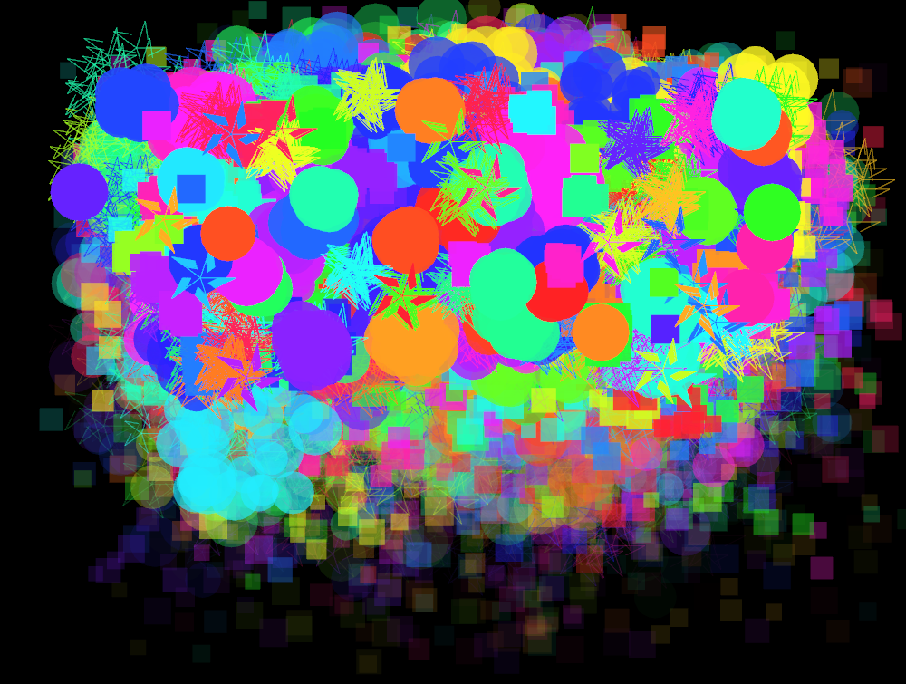

- Hay tres tipos de explosión:
  - **Circular** → se dispersan en círculo.
  - **Random** → se dispersan en cualquier dirección.
  - **Star** → forma de estrella con rayos desde el centro.
- Puedo interactuar con la app:
  - **Clic del mouse** → genera una partícula.

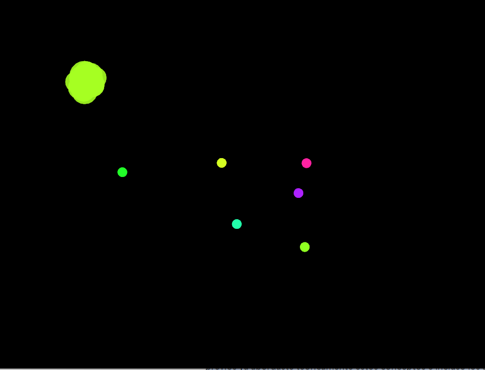

  - **Barra espaciadora** → genera 1000 partículas de golpe.

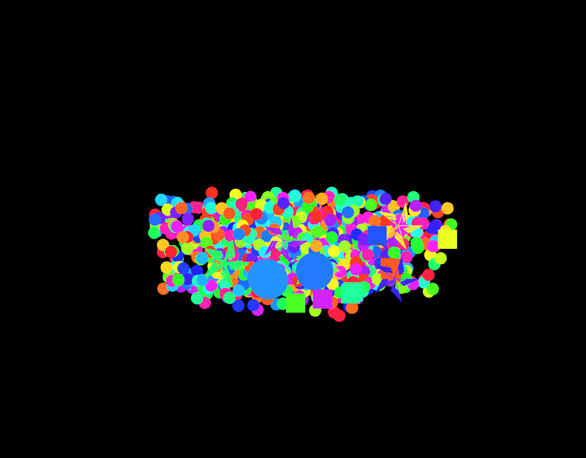
  
  - **Tecla 's'** → guarda una captura de pantalla.


**Clases principales y cómo funcionan**

**Particle (clase base)**  
- Es abstracta, o sea, no se puede usar sola.  
- Define métodos básicos que todas las partículas deben tener: `update()`, `draw()`, `isDead()`.  
- También tiene `shouldExplode()` para saber si la partícula debe explotar.

**RisingParticle**  
- Es la partícula que sube.  
- Guarda **posición, velocidad, color, tiempo de vida y si explotó**.  
- En cada `update()`:
  - Suma velocidad a la posición.  
  - Suma gravedad para que se vea más real.  
  - Chequea si debe explotar.  
- `draw()` → dibuja un círculo de color.

**ExplosionParticle**  
- Base para las partículas de explosión.  
- Cambia de posición según su velocidad y va perdiendo opacidad hasta desaparecer.

**Tipos de explosión**  
- **CircularExplosion** → partículas que salen formando un círculo.  
- **RandomExplosion** → partículas que van en cualquier dirección.  
- **StarExplosion** → partículas que forman una estrella con líneas.


**Manejo de la escena (`ofApp`)**

- `setup()` → inicializa el fondo negro y 60 FPS.  
- `update()` → actualiza todas las partículas y elimina las que ya murieron.  
- `draw()` → dibuja todas las partículas.  
- `createRisingParticle()` → genera una partícula que sube desde abajo.  
- `mousePressed()` → cada clic crea una partícula.  
- `keyPressed()` → barra espaciadora genera muchas partículas; `'s'` guarda captura.  
- Destructor `~ofApp()` → limpia la memoria borrando todas las partículas.
# Actividad 3
**Vtable de `CircularExplosion`**

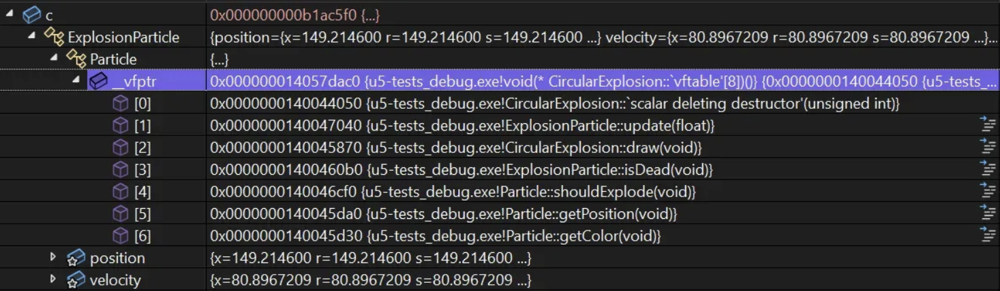

Al expandir `_vfptr` del objeto `CircularExplosion` en el depurador pude observar
las siguientes entradas en la tabla de funciones virtuales:

| Índice | Función |
|--------|---------|
| [0] | `CircularExplosion::scalar deleting destructor` |
| [1] | `ExplosionParticle::update(float)` |
| [2] | `CircularExplosion::draw(void)` |
| [3] | `ExplosionParticle::isDead(void)` |
| [4] | `Particle::shouldExplode(void)` |
| [5] | `Particle::getPosition(void)` |
| [6] | `Particle::getColor(void)` |

Al observar la tabla noto que tiene 7 entradas, una por cada método virtual de toda
la jerarquía. El destructor en [0] apunta a `CircularExplosion` porque es la clase
más derivada y debe encargarse de liberar su propia memoria. El método `update` en [1]
apunta a `ExplosionParticle::update`, lo que me indica que `CircularExplosion` no
sobreescribió ese método y lo hereda directamente de `ExplosionParticle`. El método
`draw` en [2] sí apunta a `CircularExplosion::draw`, lo que confirma que esta clase
tiene su propia implementación de ese método. Los métodos restantes (`isDead`,
`shouldExplode`, `getPosition`, `getColor`) apuntan a implementaciones de clases base,
lo que significa que `CircularExplosion` no los sobreescribió.

**Vtable de `StarExplosion`**

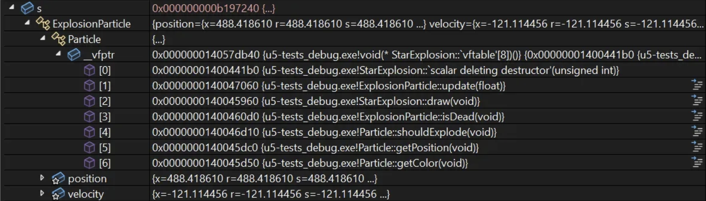

Al expandir `_vfptr` del objeto `StarExplosion` observé las siguientes entradas:

| Índice | Función |
|--------|---------|
| [0] | `StarExplosion::scalar deleting destructor` |
| [1] | `ExplosionParticle::update(float)` |
| [2] | `StarExplosion::draw(void)` |
| [3] | `ExplosionParticle::isDead(void)` |
| [4] | `Particle::shouldExplode(void)` |
| [5] | `Particle::getPosition(void)` |
| [6] | `Particle::getColor(void)` |

**Comparación de ambas vtables**

Al comparar las dos tablas puedo ver que tienen exactamente la misma estructura:
7 entradas en el mismo orden. Sin embargo, hay diferencias puntuales en algunas entradas:

| Índice | CircularExplosion | StarExplosion |
|--------|------------------|---------------|
| [0] | `CircularExplosion::destructor` | `StarExplosion::destructor` |
| [1] | `ExplosionParticle::update` — igual | `ExplosionParticle::update` — igual |
| [2] | `CircularExplosion::draw` — diferente | `StarExplosion::draw` — diferente |
| [3] | `ExplosionParticle::isDead` — igual | `ExplosionParticle::isDead` — igual |
| [4] | `Particle::shouldExplode` — igual | `Particle::shouldExplode` — igual |
| [5] | `Particle::getPosition` — igual | `Particle::getPosition` — igual |
| [6] | `Particle::getColor` — igual | `Particle::getColor` — igual |

De esta comparación concluyo que cada clase concreta tiene su propia vtable, aunque
comparten la misma estructura. Las entradas que difieren corresponden exactamente a los
métodos que cada clase sobreescribió: el destructor y `draw`. El resto apunta a las
mismas implementaciones de las clases base, porque ninguna de las dos clases los
sobreescribió.

**Para qué sirve la tabla de funciones virtuales**

La vtable es el mecanismo que hace posible el polimorfismo en tiempo de ejecución.

Cuando el código ejecuta `particles[i]->update(dt)`, el compilador no sabe en tiempo
de compilación si `particles[i]` apunta a un `CircularExplosion`, un `StarExplosion`
u otro tipo. Lo único que conoce es que es un puntero de tipo `Particle*`.

En tiempo de ejecución el programa realiza los siguientes pasos:
1. Sigue el puntero `particles[i]` hasta el objeto real en memoria.
2. Lee el `_vfptr` del objeto, que apunta a la vtable de su clase real.
3. Busca la entrada correspondiente al método `update` en esa vtable.
4. Ejecuta el puntero de función que encuentra ahí.

Esto es equivalente a lo que ocurre en C# con interfaces. En el ejemplo de `IAnimal`,
el objeto `Perro` tiene una vtable donde `HacerSonido` apunta a `Perro::HacerSonido`,
y el objeto `Gato` tiene una vtable donde `HacerSonido` apunta a `Gato::HacerSonido`.
Al llamar `animal.HacerSonido()`, el runtime consulta la vtable del objeto real y
ejecuta la función correcta de forma automática.

Sin la vtable, el compilador resolvería la llamada en tiempo de compilación usando el
tipo del puntero (`Particle`), y siempre ejecutaría `Particle::update` sin importar
el tipo real del objeto. La vtable es lo que le da a cada objeto memoria de su tipo
real durante la ejecución.

**Relación entre métodos virtuales, vtable y polimorfismo**

El método `HacerSonido` se llama de forma idéntica en cada iteración del `foreach`,
pero produce resultados diferentes porque el programa no resuelve qué función ejecutar
en tiempo de compilación sino en tiempo de ejecución. Cuando llega a `animal.HacerSonido()`,
sigue el `_vfptr` del objeto real, consulta su vtable y ejecuta el puntero de función
que encuentra ahí. El objeto `Perro` tiene en su vtable `HacerSonido → Perro::HacerSonido`
y el objeto `Gato` tiene `HacerSonido → Gato::HacerSonido`, por eso el resultado es
diferente aunque la llamada sea la misma.


La función sabe sobre cuál objeto actuar porque recibe implícitamente un puntero `this`
al objeto concreto que está en memoria. No actúa sobre un `IAnimal` abstracto sino sobre
el `Perro` o el `Gato` real. En C++ este mecanismo es visible en el depurador a través
de la vtable; en C# ocurre igual pero el lenguaje lo oculta detrás de las interfaces.

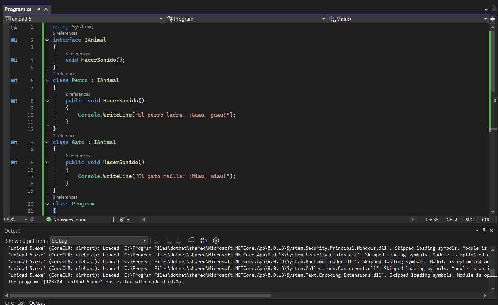
# Actividad 4
**Experimento: modificadores de acceso**


Al compilar el código con las líneas comentadas el programa compila y ejecuta sin
problemas. La única línea activa es `ac.publicVar = 10`, que es válida porque
`publicVar` es un miembro público y puede ser accedido desde cualquier parte del código.

Al descomentar las líneas `ac.protectedVar = 20` y `ac.privateVar = 30` el compilador
lanza errores de compilación. El programa ya no puede construirse porque está intentando
acceder a miembros `protected` y `private` desde fuera de la clase, lo cual el
compilador no permite.

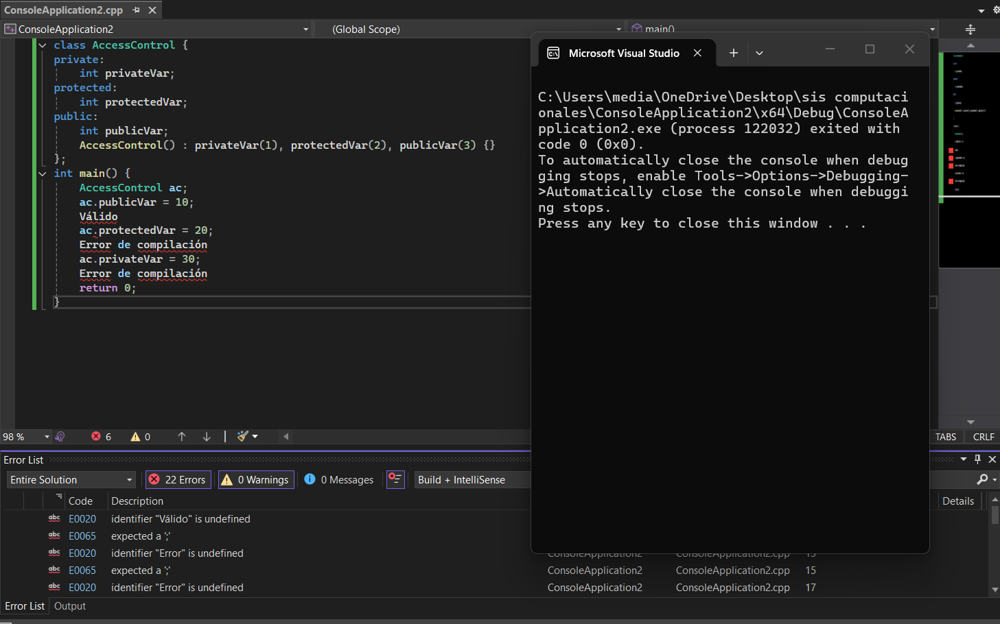

Esto sucede porque en C++ los modificadores de acceso son restricciones que el
compilador aplica en tiempo de compilación. Un miembro `private` solo puede ser
accedido desde dentro de la misma clase, y un miembro `protected` solo puede ser
accedido desde la misma clase o desde clases derivadas. Intentar acceder a ellos
desde `main`, que es código externo a la clase, viola esas reglas y el compilador
lo rechaza antes de que el programa pueda ejecutarse.

Concluyo que el encapsulamiento en C++ es una garantía del compilador, no del
programa en ejecución. Si el código viola las reglas de acceso, simplemente no compila.


**Experimento: acceso directo a miembro privado**

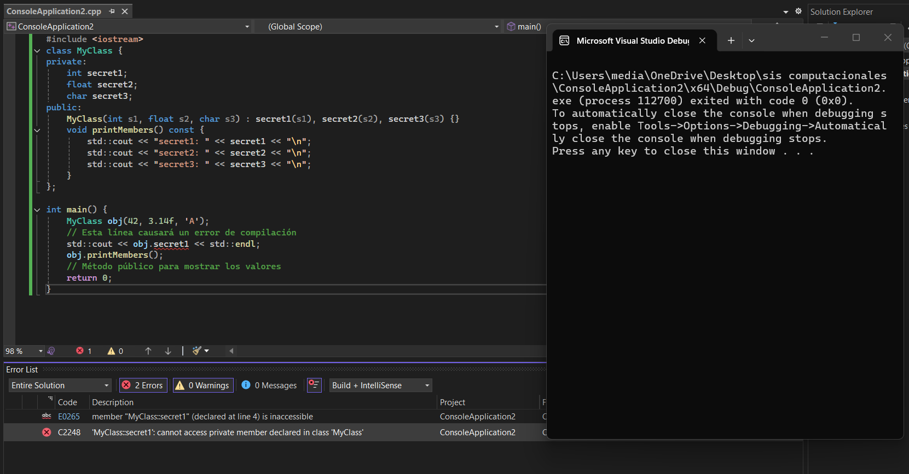

Al compilar el programa el compilador lanza dos errores sobre la línea
`std::cout << obj.secret1`:

- `E0265`: member "MyClass::secret1" is inaccessible
- `C2248`: cannot access private member declared in class 'MyClass'

El programa no compila porque `secret1` es un miembro `private` y se está intentando
acceder a él directamente desde `main`, que es código externo a la clase. El compilador
detecta esta violación y rechaza el código antes de ejecutarlo.

**Experimento: violando el encapsulamiento con reinterpret_cast**

Al compilar y ejecutar el programa pude observar que no lanza ningún error y imprime
correctamente los tres valores privados del objeto:

- secret1: 42
- secret2: 3.14
- secret3: A

Esto ocurre porque `reinterpret_cast` me permitió reinterpretar el bloque de memoria
del objeto como un puntero crudo, ignorando completamente las reglas de acceso de la
clase. Al tomar la dirección del objeto y avanzar el puntero por los tamaños de cada
tipo (`int`, `float`, `char`), pude leer directamente cada campo privado desde memoria.

Concluyo que el encapsulamiento solo está garantizado en tiempo de compilación. Una
vez que el programa está en ejecución, todos los campos del objeto existen en memoria
y es posible acceder a ellos manipulando punteros directamente.

**¿Qué es el encapsulamiento y por qué es importante?**

El encapsulamiento es el principio de ocultar los datos internos de un objeto y
permitir el acceso a ellos únicamente a través de una interfaz pública controlada.
En C++ lo implemento usando los modificadores `private`, `protected` y `public`, que
le indican al compilador qué código puede acceder a qué miembros.


Lo considero importante porque protege la integridad del estado interno del objeto:
si cualquier parte del programa pudiera modificar los datos directamente, sería muy
difícil garantizar que el objeto siempre esté en un estado válido. Al obligar a pasar
por métodos públicos, la clase puede validar y controlar cualquier cambio en sus datos.
También reduce el acoplamiento entre clases, porque el código externo depende solo de
la interfaz pública y no de cómo está implementada internamente la clase.
# Actividad 5

**¿Qué puedo observar al capturar la memoria de un objeto `CircularExplosion`?**

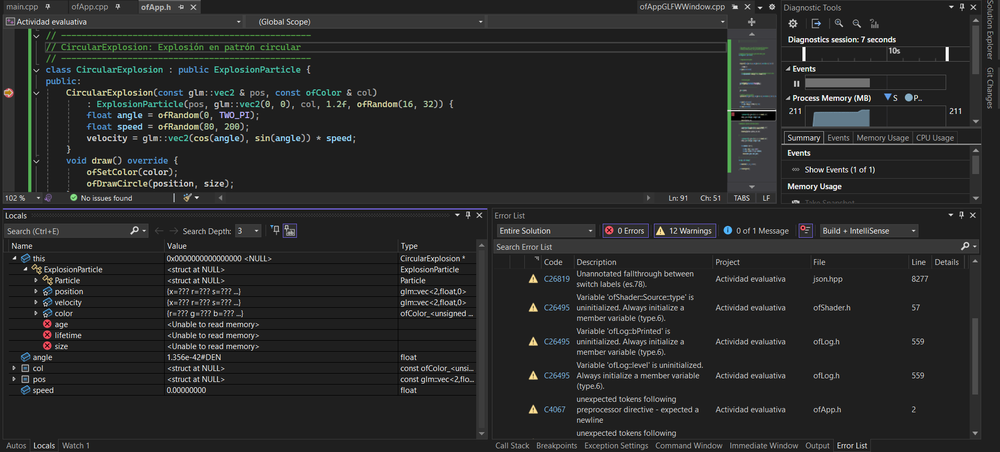

Al analizar la evidencia en el depurador, observé que el objeto `CircularExplosion` contiene internamente la información de sus clases base, lo cual confirma cómo funciona la herencia en memoria.

En la ventana de variables locales (`Locals`) se puede ver claramente la jerarquía:
- `this` → tipo `CircularExplosion*`
- Dentro de este:
- `ExplosionParticle`
- `Particle`
- `position`
- `velocity`
- `color`
- `age`
- `lifetime`
- `size`
- Además de variables propias del constructor como `angle`, `speed`, `pos`, `col`

Esto demuestra que el objeto no solo contiene sus propios datos, sino también los heredados de `ExplosionParticle` y `Particle`. Es decir, en memoria el objeto está compuesto por todos los atributos de la cadena de herencia.

También observé que algunos valores aparecen como:
<Unable to read memory> ``` Esto sucede porque el breakpoint se encuentra dentro del constructor, por lo que algunos atributos aún no han sido completamente inicializados en ese momento.

El depurador me proporciona información importante como:

- El tipo real del objeto (CircularExplosion*)

- La estructura jerárquica de las clases
- Los atributos heredados organizados dentro del objeto
- El estado actual de la memoria (valores válidos o no inicializados)

Puedo concluir que en C++ la herencia se implementa de forma física en memoria, donde el objeto derivado contiene directamente los datos de sus clases base. Esto confirma que no es solo una relación conceptual, sino también estructural.

**¿Cómo se implementa la herencia en C++?**

La herencia en C++ se implementa utilizando la siguiente sintaxis:
```c++
class ClaseHija : public ClasePadre {
};
```

En este caso:
```c++
class CircularExplosion : public ExplosionParticle {
};
```

Esto indica que `CircularExplosion` hereda todos los atributos y métodos públicos y protegidos de `ExplosionParticle`, y a su vez, de `Particle`.

El uso de `public` significa que los miembros públicos de la clase base siguen siendo públicos en la clase derivada. Además, mediante funciones virtuales (virtual), se permite el uso de `polimorfismo`, donde el método ejecutado depende del tipo real del objeto en tiempo de ejecución.

**Experimento de herencia múltiple y evidencia en memoria**

Para comprobar la herencia múltiple, implementé tres clases:
```c++
class A {
public:
    int a;
};

class B {
public:
    int b;
};

class C : public A, public B {
public:
    int c;
};
```
Luego creé una instancia dentro del método setup():
```c++
C obj;
obj.a = 10;
obj.b = 20;
obj.c = 30;

int pausa = 0;
```
Coloqué un breakpoint en la línea de pausa y ejecuté el programa en modo debug. Al detenerse la ejecución, inspeccioné la variable obj en la ventana Locals del depurador.

A partir de la evidencia observada, el objeto obj se descompone en:
- Subobjeto A, que contiene el atributo a = 10
- Subobjeto B, que contiene el atributo b = 20
- Atributo propio c = 30

Esto se puede ver claramente en la estructura mostrada por el depurador, donde aparecen A y B como partes internas del objeto C.

**Conclusión**

Puedo concluir que en C++ la herencia múltiple se refleja directamente en la memoria del objeto. La clase derivada C contiene internamente los subobjetos correspondientes a cada clase base (A y B), además de sus propios atributos. Esto demuestra que la herencia no solo es una relación lógica entre clases, sino también una composición real en la estructura de memoria del objeto.

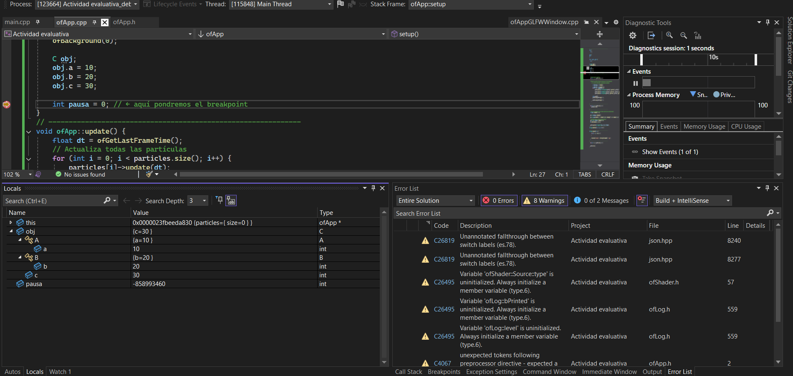

# Actividad 6

**Observaciones en el depurador**

Al colocar un breakpoint en la línea `particles[i]->update(dt)` dentro del método
`update()` de `ofApp` y correr la aplicación, pude observar en la ventana Locals que
el vector `particles` contiene objetos de diferentes tipos al mismo tiempo. En la
primera captura el vector tiene `size=10` y todos los elementos aparecen con tipo
`Particle * {SpiralParti...}`, confirmando que son objetos de tipo `SpiralParticle`.
En la segunda captura, al expandir el elemento `[0]`, puedo ver que el tipo real es
`RisingParticle`, con todos sus campos internos visibles: `position`, `velocity`,
`color`, `lifetime`, `age`, `exploded`, y su propia `_vfptr` apuntando a la vtable
de `RisingParticle`.

Lo más importante que observé es que aunque el vector declara sus elementos como
`Particle*`, cada objeto en memoria sabe exactamente qué tipo es gracias a su `_vfptr`.
Cuando el programa llega a `particles[i]->update(dt)`, no ejecuta siempre la misma
función sino que consulta la vtable del objeto real y ejecuta la implementación
correspondiente a su clase concreta.

**Diagrama: polimorfismo en tiempo de ejecución**


Llamada: particles[i]->update(dt)
  1. Accede al objeto real en memoria
  2. Lee su _vfptr para encontrar su vtable
  3. Busca la entrada de update() en esa vtable
  4. Ejecuta el puntero de función que encuentra ahí


Concluyo que el polimorfismo en tiempo de ejecución es posible gracias a la vtable.
Cada objeto carga un `_vfptr` que apunta a la vtable de su clase real. Aunque el
vector solo conoce a todos sus elementos como `Particle*`, en tiempo de ejecución
cada objeto ejecuta su propia versión de `update()` según su tipo real.

**Relación entre métodos virtuales y polimorfismo**

Los métodos virtuales son el mecanismo que hace posible el polimorfismo en tiempo
de ejecución. Al declarar `update()` como `virtual` en la clase `Particle`, le indico
al compilador que la resolución de esa función debe diferirse a tiempo de ejecución
usando la vtable. Sin `virtual`, el compilador resolvería siempre `Particle::update()`
en tiempo de compilación ignorando el tipo real del objeto. Con `virtual`, el despacho
se hace en tiempo de ejecución a través de la vtable, permitiendo que el mismo código
produzca comportamientos completamente diferentes según el tipo concreto del objeto.

# Actividad 7
**Of app h**
```c++
#pragma once
#include "ofMain.h"
#include <vector>

// -------------------------------------------------
// Clase base abstracta: Particle
// -------------------------------------------------
class Particle {
public:
	virtual ~Particle() { }
	virtual void update(float dt) = 0;
	virtual void draw() = 0;
	virtual bool isDead() const = 0;
	virtual bool shouldExplode() const { return false; }
	virtual glm::vec2 getPosition() const { return glm::vec2(0, 0); }
	virtual ofColor getColor() const { return ofColor(255); }
};

// -------------------------------------------------
// RisingParticle: Partícula que sube en línea recta
// -------------------------------------------------
class RisingParticle : public Particle {
protected:
	glm::vec2 position;
	glm::vec2 velocity;
	ofColor color;
	float lifetime;
	float age;
	bool exploded;

public:
	RisingParticle(const glm::vec2 & pos, const glm::vec2 & vel, const ofColor & col, float life)
		: position(pos)
		, velocity(vel)
		, color(col)
		, lifetime(life)
		, age(0)
		, exploded(false) { }

	void update(float dt) override {
		position += velocity * dt;
		age += dt;
		velocity.y += 9.8f * dt * 8;
		float explosionThreshold = ofGetHeight() * 0.15 + ofRandom(-30, 30);
		if (position.y <= explosionThreshold || age >= lifetime) {
			exploded = true;
		}
	}
	void draw() override {
		ofSetColor(color);
		ofDrawCircle(position, 10);
	}
	bool isDead() const override { return exploded; }
	bool shouldExplode() const override { return exploded; }
	glm::vec2 getPosition() const override { return position; }
	ofColor getColor() const override { return color; }
};

// -------------------------------------------------
// SpiralParticle: Partícula que sube en espiral
// -------------------------------------------------
class SpiralParticle : public Particle {
protected:
	glm::vec2 position;
	glm::vec2 velocity;
	ofColor color;
	float lifetime;
	float age;
	bool exploded;
	float angle;
	float spiralSpeed;

public:
	SpiralParticle(const glm::vec2 & pos, const glm::vec2 & vel, const ofColor & col, float life)
		: position(pos)
		, velocity(vel)
		, color(col)
		, lifetime(life)
		, age(0)
		, exploded(false)
		, angle(0)
		, spiralSpeed(5.0f) { }

	void update(float dt) override {
		age += dt;
		angle += spiralSpeed * dt;
		// Sube verticalmente pero oscila horizontalmente en espiral
		position.y += velocity.y * dt;
		position.x += cos(angle) * 60.0f * dt;
		velocity.y -= 9.8f * dt * 8;
		float explosionThreshold = ofGetHeight() * 0.15 + ofRandom(-30, 30);
		if (position.y <= explosionThreshold || age >= lifetime) {
			exploded = true;
		}
	}
	void draw() override {
		ofSetColor(color);
		// Se dibuja como un triángulo para distinguirse visualmente
		ofDrawTriangle(
			position.x, position.y - 12,
			position.x - 8, position.y + 8,
			position.x + 8, position.y + 8);
	}
	bool isDead() const override { return exploded; }
	bool shouldExplode() const override { return exploded; }
	glm::vec2 getPosition() const override { return position; }
	ofColor getColor() const override { return color; }
};

// -------------------------------------------------
// ZigZagParticle: Partícula que sube en zigzag
// -------------------------------------------------
class ZigZagParticle : public Particle {
protected:
	glm::vec2 position;
	glm::vec2 velocity;
	ofColor color;
	float lifetime;
	float age;
	bool exploded;
	float zigzagTimer;
	float zigzagDirection;
	float zigzagInterval;

public:
	ZigZagParticle(const glm::vec2 & pos, const glm::vec2 & vel, const ofColor & col, float life)
		: position(pos)
		, velocity(vel)
		, color(col)
		, lifetime(life)
		, age(0)
		, exploded(false)
		, zigzagTimer(0)
		, zigzagDirection(1.0f)
		, zigzagInterval(0.15f) { }

	void update(float dt) override {
		age += dt;
		zigzagTimer += dt;
		// Cada intervalo cambia de dirección horizontal
		if (zigzagTimer >= zigzagInterval) {
			zigzagDirection *= -1.0f;
			zigzagTimer = 0;
		}
		position.y += velocity.y * dt;
		position.x += zigzagDirection * 120.0f * dt;
		velocity.y -= 9.8f * dt * 8;
		float explosionThreshold = ofGetHeight() * 0.15 + ofRandom(-30, 30);
		if (position.y <= explosionThreshold || age >= lifetime) {
			exploded = true;
		}
	}
	void draw() override {
		ofSetColor(color);
		// Se dibuja como un rectángulo para distinguirse visualmente
		ofDrawRectangle(position.x - 6, position.y - 6, 12, 12);
	}
	bool isDead() const override { return exploded; }
	bool shouldExplode() const override { return exploded; }
	glm::vec2 getPosition() const override { return position; }
	ofColor getColor() const override { return color; }
};

// -------------------------------------------------
// Clase base para explosiones: ExplosionParticle
// -------------------------------------------------
class ExplosionParticle : public Particle {
protected:
	glm::vec2 position;
	glm::vec2 velocity;
	ofColor color;
	float age;
	float lifetime;
	float size;

public:
	ExplosionParticle(const glm::vec2 & pos, const glm::vec2 & vel, const ofColor & col, float life, float sz)
		: position(pos)
		, velocity(vel)
		, color(col)
		, age(0)
		, lifetime(life)
		, size(sz) { }

	void update(float dt) override {
		position += velocity * dt;
		age += dt;
		float alpha = ofMap(age, 0, lifetime, 255, 0, true);
		color.a = alpha;
	}
	bool isDead() const override { return age >= lifetime; }
};

// -------------------------------------------------
// CircularExplosion: Explosión en patrón circular
// -------------------------------------------------
class CircularExplosion : public ExplosionParticle {
public:
	CircularExplosion(const glm::vec2 & pos, const ofColor & col)
		: ExplosionParticle(pos, glm::vec2(0, 0), col, 1.2f, ofRandom(16, 32)) {
		float angle = ofRandom(0, TWO_PI);
		float speed = ofRandom(80, 200);
		velocity = glm::vec2(cos(angle), sin(angle)) * speed;
	}
	void draw() override {
		ofSetColor(color);
		ofDrawCircle(position, size);
	}
};

// -------------------------------------------------
// RandomExplosion: Explosión con direcciones aleatorias
// -------------------------------------------------
class RandomExplosion : public ExplosionParticle {
public:
	RandomExplosion(const glm::vec2 & pos, const ofColor & col)
		: ExplosionParticle(pos, glm::vec2(0, 0), col, 1.5f, ofRandom(16, 32)) {
		velocity = glm::vec2(ofRandom(-200, 200), ofRandom(-200, 200));
	}
	void draw() override {
		ofSetColor(color);
		ofDrawRectangle(position.x, position.y, size, size);
	}
};

// -------------------------------------------------
// StarExplosion: Explosión en forma de estrella
// -------------------------------------------------
class StarExplosion : public ExplosionParticle {
public:
	StarExplosion(const glm::vec2 & pos, const ofColor & col)
		: ExplosionParticle(pos, glm::vec2(0, 0), col, 1.3f, ofRandom(20, 40)) {
		float angle = ofRandom(0, TWO_PI);
		float speed = ofRandom(90, 180);
		velocity = glm::vec2(cos(angle), sin(angle)) * speed;
	}
	void draw() override {
		ofSetColor(color);
		int rays = 5;
		float outerRadius = size;
		float innerRadius = size * 0.5;
		ofPushMatrix();
		ofTranslate(position);
		for (int i = 0; i < rays; i++) {
			float theta = ofMap(i, 0, rays, 0, TWO_PI);
			float xOuter = cos(theta) * outerRadius;
			float yOuter = sin(theta) * outerRadius;
			float xInner = cos(theta + PI / rays) * innerRadius;
			float yInner = sin(theta + PI / rays) * innerRadius;
			ofDrawLine(0, 0, xOuter, yOuter);
			ofDrawLine(xOuter, yOuter, xInner, yInner);
		}
		ofPopMatrix();
	}
};

// -------------------------------------------------
// RingExplosion: Explosión en anillo uniforme
// -------------------------------------------------
class RingExplosion : public ExplosionParticle {
public:
	RingExplosion(const glm::vec2 & pos, const ofColor & col, int index, int total)
		: ExplosionParticle(pos, glm::vec2(0, 0), col, 1.4f, ofRandom(8, 16)) {
		// Distribuye los ángulos uniformemente para formar un anillo perfecto
		float angle = ofMap(index, 0, total, 0, TWO_PI);
		float speed = 150.0f;
		velocity = glm::vec2(cos(angle), sin(angle)) * speed;
	}
	void draw() override {
		ofSetColor(color);
		// Se dibuja como línea desde el centro para enfatizar el patrón de anillo
		ofDrawCircle(position, size);
		ofNoFill();
		ofSetLineWidth(2);
		ofDrawCircle(position, size * 1.5);
		ofFill();
	}
};

// -------------------------------------------------
// ofApp
// -------------------------------------------------
class ofApp : public ofBaseApp {
public:
	void setup();
	void update();
	void draw();
	void mousePressed(int x, int y, int button);
	void keyPressed(int key);
	std::vector<Particle *> particles;
	~ofApp();

private:
	void createRisingParticle();
	void createSpiralParticle();
	void createZigZagParticle();
};


```
**Of app cpp**

```c++
#include "ofApp.h"

void ofApp::setup() {
	ofSetFrameRate(60);
	ofBackground(0);
}

void ofApp::update() {
	float dt = ofGetLastFrameTime();

	for (int i = 0; i < particles.size(); i++) {
		particles[i]->update(dt);
	}

	for (int i = particles.size() - 1; i >= 0; i--) {
		if (particles[i]->shouldExplode()) {
			int explosionType = (int)ofRandom(4);
			// 0: Circular, 1: Random, 2: Star, 3: Ring (nuevo)
			int numParticles = (int)ofRandom(20, 30);
			for (int j = 0; j < numParticles; j++) {
				if (explosionType == 0) {
					particles.push_back(new CircularExplosion(
						particles[i]->getPosition(), particles[i]->getColor()));
				} else if (explosionType == 1) {
					particles.push_back(new RandomExplosion(
						particles[i]->getPosition(), particles[i]->getColor()));
				} else if (explosionType == 2) {
					particles.push_back(new StarExplosion(
						particles[i]->getPosition(), particles[i]->getColor()));
				} else {
					// RingExplosion necesita índice y total para distribuir ángulos
					particles.push_back(new RingExplosion(
						particles[i]->getPosition(), particles[i]->getColor(),
						j, numParticles));
				}
			}
			delete particles[i];
			particles.erase(particles.begin() + i);
		} else if (particles[i]->isDead()) {
			delete particles[i];
			particles.erase(particles.begin() + i);
		}
	}
}

void ofApp::draw() {
	for (int i = 0; i < particles.size(); i++) {
		particles[i]->draw();
	}
}

void ofApp::createRisingParticle() {
	float minX = ofGetWidth() * 0.35;
	float maxX = ofGetWidth() * 0.65;
	float spawnX = ofRandom(minX, maxX);
	glm::vec2 pos(spawnX, ofGetHeight());
	glm::vec2 target(ofGetWidth() / 2 + ofRandom(-300, 300), ofGetHeight() * 0.10 + ofRandom(-30, 30));
	glm::vec2 direction = glm::normalize(target - pos);
	glm::vec2 vel = direction * ofRandom(250, 350);
	ofColor col;
	col.setHsb(ofRandom(255), 220, 255);
	float lifetime = ofRandom(1.5, 3.5);
	particles.push_back(new RisingParticle(pos, vel, col, lifetime));
}

void ofApp::createSpiralParticle() {
	float spawnX = ofGetWidth() / 2 + ofRandom(-100, 100);
	glm::vec2 pos(spawnX, ofGetHeight());
	glm::vec2 vel(0, -ofRandom(300, 450));
	ofColor col;
	col.setHsb(ofRandom(100, 180), 220, 255);
	float lifetime = ofRandom(1.5, 3.0);
	particles.push_back(new SpiralParticle(pos, vel, col, lifetime));
}

void ofApp::createZigZagParticle() {
	float spawnX = ofGetWidth() / 2 + ofRandom(-100, 100);
	glm::vec2 pos(spawnX, ofGetHeight());
	glm::vec2 vel(0, -ofRandom(300, 450));
	ofColor col;
	col.setHsb(ofRandom(180, 255), 220, 255);
	float lifetime = ofRandom(1.5, 3.0);
	particles.push_back(new ZigZagParticle(pos, vel, col, lifetime));
}

void ofApp::mousePressed(int x, int y, int button) {
	createRisingParticle();
}

void ofApp::keyPressed(int key) {
	if (key == ' ') {
		for (int i = 0; i < 1000; i++) {
			createRisingParticle();
		}
	}
	// Tecla 'z' para lanzar SpiralParticle
	if (key == 'z') {
		for (int i = 0; i < 10; i++) {
			createSpiralParticle();
		}
	}
	// Tecla 'x' para lanzar ZigZagParticle
	if (key == 'x') {
		for (int i = 0; i < 10; i++) {
			createZigZagParticle();
		}
	}
	if (key == 's') {
		ofSaveScreen("screenshot_" + ofToString(ofGetFrameNum()) + ".png");
	}
}

ofApp::~ofApp() {
	for (int i = 0; i < particles.size(); i++) {
		delete particles[i];
	}
	particles.clear();
}


```

**Main cpp**

```c++
#include "ofApp.h"
#include "ofMain.h"

//========================================================================
int main() {

	//Use ofGLFWWindowSettings for more options like multi-monitor fullscreen
	ofGLWindowSettings settings;
	settings.setSize(1024, 768);
	settings.windowMode = OF_WINDOW; //can also be OF_FULLSCREEN

	auto window = ofCreateWindow(settings);

	ofRunApp(window, std::make_shared<ofApp>());
	ofRunMainLoop();
}


```

**¿Cómo y por qué implementé las extensiones solicitadas?**


Implementé dos nuevos tipos de partículas llamados `SpiralParticle` y `ZigZagParticle`, ambos derivados de la clase base `Particle`. En el caso de `SpiralParticle`, añadí variables como `angle` y `spiralSpeed` para modificar su movimiento. En el método `update()`, hice que la partícula ascendiera verticalmente mientras oscilaba en el eje X usando la función coseno, generando un movimiento en espiral. Decidí implementar este comportamiento para simular trayectorias más naturales y visualmente interesantes, similares a ciertos fuegos artificiales reales.

Para `ZigZagParticle`, implementé un sistema de cambio de dirección horizontal basado en tiempo. Utilicé variables como `zigzagTimer`, `zigzagDirection` y `zigzagInterval` para invertir la dirección en el eje X en intervalos regulares. Esto produce un movimiento en zigzag mientras la partícula asciende. Elegí este comportamiento para introducir variación e imprevisibilidad en el sistema.

También implementé un nuevo tipo de explosión llamado `RingExplosion`. En este caso, distribuí las partículas uniformemente en un círculo utilizando el índice de cada partícula y el total de partículas generadas. Calculé el ángulo con `ofMap` para asegurar una distribución equidistante. Esta implementación permite crear una explosión ordenada en forma de anillo, diferenciándose de otros tipos más aleatorios.

**¿Cómo y por qué implementé encapsulamiento, herencia y polimorfismo?**

Apliqué encapsulamiento al definir atributos como `position`, `velocity`, `color`, `age` y `lifetime` como miembros protegidos o privados dentro de cada clase. El acceso a estos datos se realiza mediante métodos como `getPosition()` y `getColor()`, evitando modificaciones externas directas. Esto mejora la seguridad del código y facilita su mantenimiento.

Utilicé herencia al crear una clase base abstracta `Particle`, de la cual derivan todas las demás clases (`RisingParticle`, `SpiralParticle`, `ZigZagParticle` y las explosiones). Esto me permitió reutilizar estructura y comportamiento común, obligando a cada clase hija a implementar sus propios métodos `update()` y `draw()`.

El polimorfismo lo implementé utilizando un `std::vector<Particle*>`, donde almaceno distintos tipos de partículas bajo un mismo tipo base. Al recorrer este vector y llamar a métodos como `update()` y `draw()`, el programa ejecuta automáticamente la versión correspondiente según el tipo real del objeto. Esto permite manejar múltiples comportamientos distintos de forma uniforme.

**¿Cómo verifiqué que las extensiones funcionan correctamente?**

Verifiqué el funcionamiento utilizando el depurador de Visual Studio. En la ventana de variables locales pude observar que el vector `particles` contiene instancias de diferentes tipos, como `SpiralParticle` y `ZigZagParticle`, lo que confirma que el polimorfismo está funcionando en tiempo de ejecución.

También comprobé visualmente que cada tipo de partícula presenta un comportamiento distinto: algunas suben en línea recta, otras en espiral y otras en zigzag. Esto confirma que cada implementación de `update()` se ejecuta correctamente según el tipo.

Finalmente, validé los distintos tipos de explosión observando que se generan patrones diferentes (circular, aleatorio, estrella y anillo), lo que demuestra que la selección mediante `explosionType` funciona correctamente.

### **Evidencia visual del polimorfismo en tiempo de ejecución.**

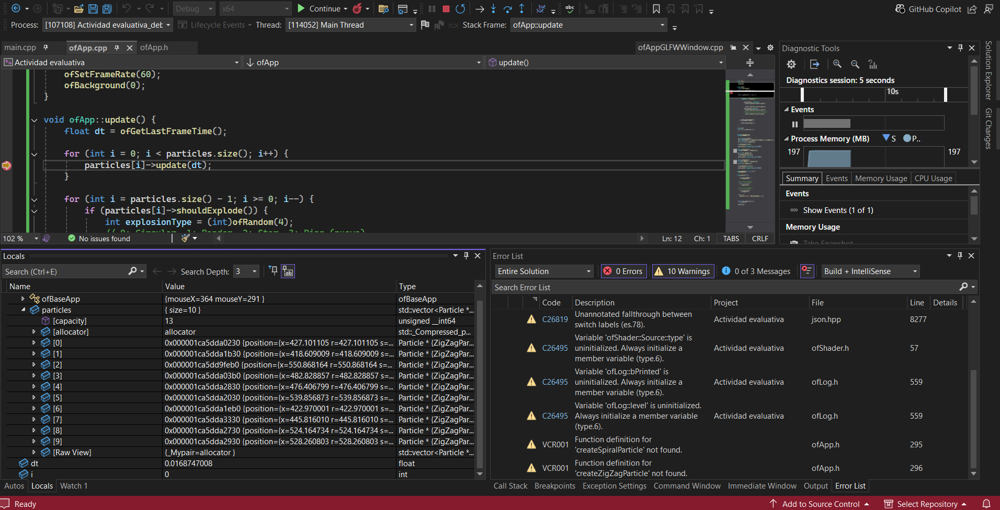

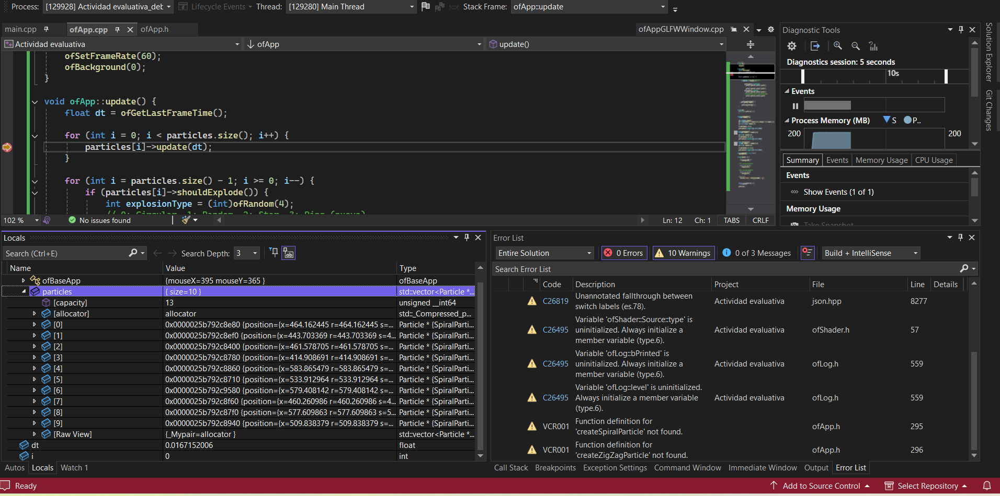