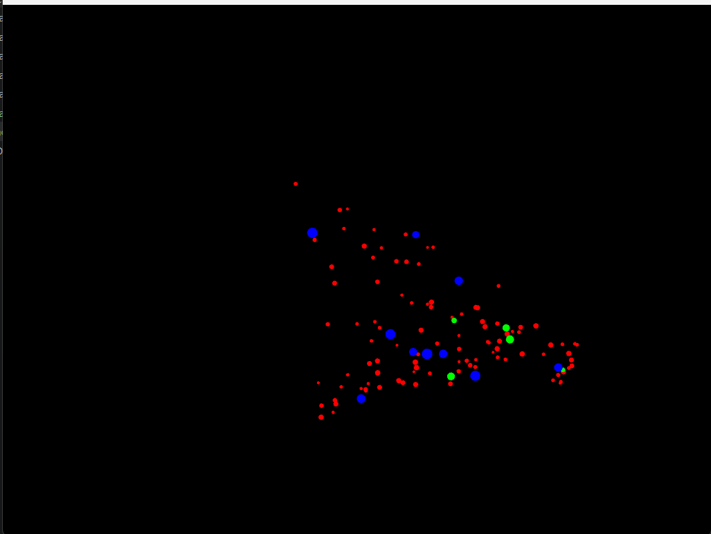
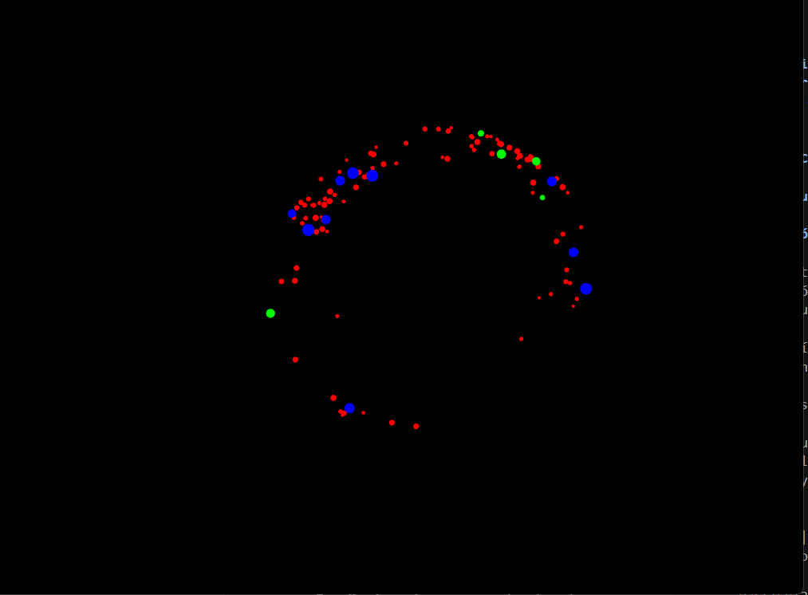
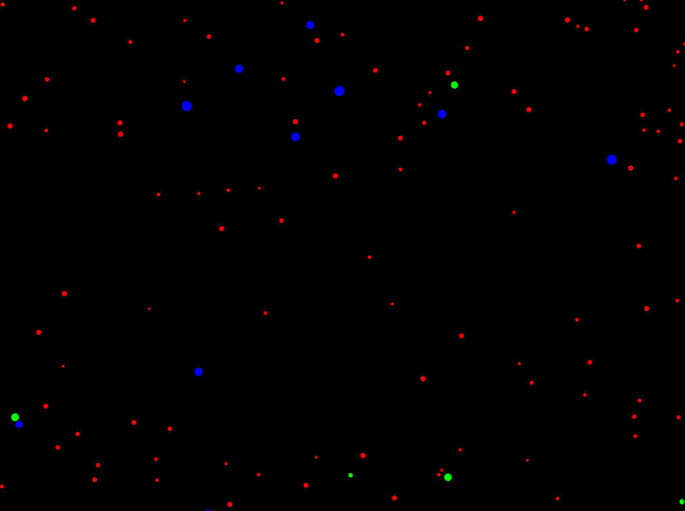
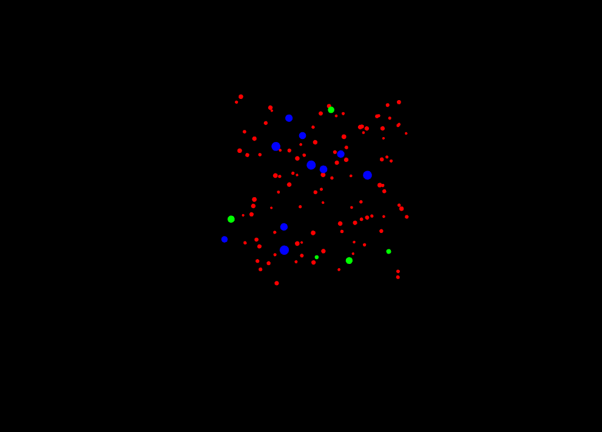
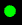
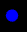

## Actividad 1: Exploración del caso de estudio

### 1. ¿Cómo puedo interactuar con la aplicación?

Al ejecutar la aplicación observo una pantalla negra con partículas de distintos colores moviéndose. Puedo interactuar usando el teclado y el mouse:

| Tecla | Efecto sobre las partículas |
|-------|----------------------------|
| `a`   | Las partículas se atraen hacia el cursor del mouse |
| `r`   | Las partículas huyen del cursor del mouse |
| `s`   | Las partículas desaceleran gradualmente hasta detenerse |
| `n`   | Las partículas regresan a su movimiento aleatorio normal |

El mouse actúa como punto de referencia para los estados de atracción y repulsión.

Cuando se presiona **a**

Cuando se presiona **r**

Cuando se presiona **s**

Cuando se presiona **n**

### 2. ¿Observo diferentes tipos de partículas?

Sí, distingo tres tipos de partículas al inicio, aunque todas tienen forma de círculo porque el código usa `ofDrawCircle()` para dibujarlas. La diferencia entre tipos es únicamente de tamaño y color, no de forma:

- **círculos pequeños (2–4 px) de color **rojo****, movimiento lento y aleatorio. Son las más numerosas (100 partículas).

- **círculos medianos (3–6 px) de color **verde****, con velocidad inicial 3× mayor que las demás, por lo que se desplazan rápidamente por la pantalla. Hay 5.

- **círculos grandes (5–8 px) de color **azul****, movimiento lento. Hay 10.

Todas se comportan igual en cuanto a la lógica de movimiento inicial (deriva aleatoria con `NormalState`), pero se distinguen visualmente por tamaño y color.

### 3. Hipótesis inicial sobre lo que ocurre "detrás de cámaras"

Mi hipótesis es que cada partícula "sabe" en qué modo está y actúa en consecuencia. Cuando presiono una tecla, creo que la aplicación le avisa de alguna forma a todas las partículas a la vez, y cada una cambia su comportamiento por sí sola: empieza a seguir al mouse, a alejarse de él, a frenarse o a moverse libremente. No creo que haya un único lugar del código que mueva cada partícula a mano, sino que cada una reacciona al aviso de forma independiente.

---
