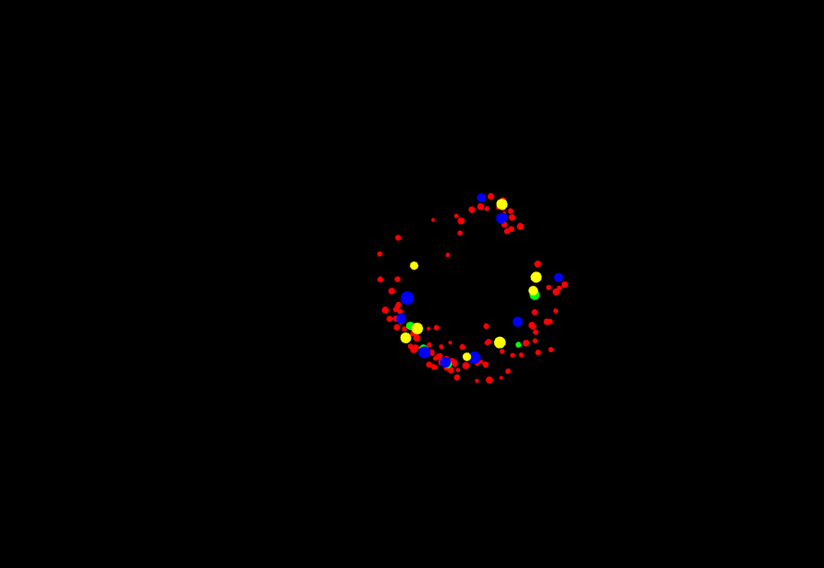

## Actividad 5: Nueva partícula con los tres patrones

Para esta actividad decidí agregar una partícula llamada `"circler"`. Su comportamiento es simple: cuando presiono la tecla `c`, todas las partículas empiezan a girar en círculos alrededor del punto donde estaban en ese momento. Elegí esta idea porque es fácil de ver visualmente y me permitía aplicar los tres patrones de forma clara.

---

### 1. Código fuente completo

**ofApp.h**

```cpp
#pragma once
#include "ofMain.h"
#include <string>
#include <vector>

class Observer {
public:
    virtual ~Observer() = default;
    virtual void onNotify(const std::string& event) = 0;
};

class Subject {
public:
    void addObserver(Observer* observer);
    void removeObserver(Observer* observer);
protected:
    void notify(const std::string& event);
private:
    std::vector<Observer*> observers;
};

class Particle;

class State {
public:
    virtual ~State() = default;
    virtual void update(Particle* particle) = 0;
    virtual void onEnter(Particle* particle) {}
    virtual void onExit(Particle* particle) {}
};

class Particle : public Observer {
public:
    Particle();
    ~Particle() override;
    Particle(const Particle&) = delete;
    Particle& operator=(const Particle&) = delete;
    void update();
    void draw();
    void onNotify(const std::string& event) override;
    void setState(State* newState);
    ofVec2f position;
    ofVec2f velocity;
    float size;
    ofColor color;
private:
    void keepInsideWindow();
    State* state;
};

class NormalState : public State {
public:
    void update(Particle* particle) override;
    void onEnter(Particle* particle) override;
};

class AttractState : public State {
public:
    void update(Particle* particle) override;
};

class RepelState : public State {
public:
    void update(Particle* particle) override;
};

class StopState : public State {
public:
    void update(Particle* particle) override;
};

class CircleState : public State {
public:
    void update(Particle* particle) override;
    void onEnter(Particle* particle) override;
private:
    ofVec2f center;
    float angle;
    float radius;
};

class ParticleFactory {
public:
    static Particle* createParticle(const std::string& type);
};

class ofApp : public ofBaseApp, public Subject {
public:
    ~ofApp() override;
    void setup() override;
    void update() override;
    void draw() override;
    void keyPressed(int key) override;
private:
    std::vector<Particle*> particles;
};
```

**ofApp.cpp**

```cpp
#include "ofApp.h"
#include <algorithm>

void Subject::addObserver(Observer* observer) {
    if (!observer) return;
    if (std::find(observers.begin(), observers.end(), observer) == observers.end()) {
        observers.push_back(observer);
    }
}

void Subject::removeObserver(Observer* observer) {
    if (!observer) return;
    observers.erase(std::remove(observers.begin(), observers.end(), observer), observers.end());
}

void Subject::notify(const std::string& event) {
    for (Observer* observer : observers) {
        observer->onNotify(event);
    }
}

Particle::Particle() : state(nullptr) {
    position = ofVec2f(ofRandomWidth(), ofRandomHeight());
    velocity = ofVec2f(ofRandom(-0.5f, 0.5f), ofRandom(-0.5f, 0.5f));
    size = ofRandom(2.0f, 5.0f);
    color = ofColor(255);
    state = new NormalState();
    state->onEnter(this);
}

Particle::~Particle() {
    if (state) {
        state->onExit(this);
        delete state;
        state = nullptr;
    }
}

void Particle::setState(State* newState) {
    if (state) {
        state->onExit(this);
        delete state;
    }
    state = newState;
    if (state) {
        state->onEnter(this);
    }
}

void Particle::update() {
    if (state) {
        state->update(this);
    }
    keepInsideWindow();
}

void Particle::draw() {
    ofPushStyle();
    ofSetColor(color);
    ofDrawCircle(position, size);
    ofPopStyle();
}

void Particle::onNotify(const std::string& event) {
    if (event == "attract") {
        setState(new AttractState());
    }
    else if (event == "repel") {
        setState(new RepelState());
    }
    else if (event == "stop") {
        setState(new StopState());
    }
    else if (event == "normal") {
        setState(new NormalState());
    }
    else if (event == "circle") {
        setState(new CircleState());
    }
}

void Particle::keepInsideWindow() {
    const float W = static_cast<float>(ofGetWidth());
    const float H = static_cast<float>(ofGetHeight());
    if (position.x < 0.0f) {
        position.x = 0.0f;
        velocity.x *= -1.0f;
    }
    else if (position.x > W) {
        position.x = W;
        velocity.x *= -1.0f;
    }
    if (position.y < 0.0f) {
        position.y = 0.0f;
        velocity.y *= -1.0f;
    }
    else if (position.y > H) {
        position.y = H;
        velocity.y *= -1.0f;
    }
}

void NormalState::onEnter(Particle* particle) {
    particle->velocity.set(ofRandom(-0.5f, 0.5f), ofRandom(-0.5f, 0.5f));
}

void NormalState::update(Particle* particle) {
    particle->position += particle->velocity;
}

static void steer(Particle* particle, const ofVec2f& toward, float accel, float vmax, float posScale) {
    ofVec2f dir = toward - particle->position;
    float len = dir.length();
    if (len > 1e-6f) {
        dir /= len;
        particle->velocity += dir * accel;
    }
    particle->velocity.limit(vmax);
    particle->position += particle->velocity * posScale;
}

void AttractState::update(Particle* particle) {
    ofVec2f mouse(ofGetMouseX(), ofGetMouseY());
    steer(particle, mouse, 0.05f, 3.0f, 0.2f);
}

void RepelState::update(Particle* particle) {
    ofVec2f mouse(ofGetMouseX(), ofGetMouseY());
    ofVec2f away = particle->position - mouse;
    float len = away.length();
    if (len > 1e-6f) {
        away /= len;
        particle->velocity += away * 0.05f;
    }
    particle->velocity.limit(3.0f);
    particle->position += particle->velocity * 0.2f;
}

void StopState::update(Particle* particle) {
    particle->velocity *= 0.80f;
    if (particle->velocity.lengthSquared() < 1e-4f) {
        particle->velocity.set(0.0f, 0.0f);
    }
    particle->position += particle->velocity;
}

void CircleState::onEnter(Particle* particle) {
    center = particle->position;
    angle = 0.0f;
    radius = ofRandom(30.0f, 80.0f);
}

void CircleState::update(Particle* particle) {
    angle += 0.03f;
    particle->position.x = center.x + cos(angle) * radius;
    particle->position.y = center.y + sin(angle) * radius;
}

Particle* ParticleFactory::createParticle(const std::string& type) {
    Particle* particle = new Particle();
    if (type == "star") {
        particle->size = ofRandom(2.0f, 4.0f);
        particle->color = ofColor(255, 0, 0);
    }
    else if (type == "shooting_star") {
        particle->size = ofRandom(3.0f, 6.0f);
        particle->color = ofColor(0, 255, 0);
        particle->velocity *= 3.0f;
    }
    else if (type == "planet") {
        particle->size = ofRandom(5.0f, 8.0f);
        particle->color = ofColor(0, 0, 255);
    }
    else if (type == "circler") {
        particle->size = ofRandom(4.0f, 7.0f);
        particle->color = ofColor(255, 255, 0);
    }
    return particle;
}

ofApp::~ofApp() {
    for (Particle* p : particles) {
        removeObserver(p);
        delete p;
    }
    particles.clear();
}

void ofApp::setup() {
    ofBackground(0);
    particles.reserve(100 + 5 + 10 + 8);
    for (int i = 0; i < 100; ++i) {
        Particle* p = ParticleFactory::createParticle("star");
        particles.push_back(p);
        addObserver(p);
    }
    for (int i = 0; i < 5; ++i) {
        Particle* p = ParticleFactory::createParticle("shooting_star");
        particles.push_back(p);
        addObserver(p);
    }
    for (int i = 0; i < 10; ++i) {
        Particle* p = ParticleFactory::createParticle("planet");
        particles.push_back(p);
        addObserver(p);
    }
    for (int i = 0; i < 8; ++i) {
        Particle* p = ParticleFactory::createParticle("circler");
        particles.push_back(p);
        addObserver(p);
    }
}

void ofApp::update() {
    for (Particle* p : particles) {
        p->update();
    }
}

void ofApp::draw() {
    for (Particle* p : particles) {
        p->draw();
    }
}

void ofApp::keyPressed(int key) {
    switch (key) {
    case 's':
        notify("stop");
        break;
    case 'a':
        notify("attract");
        break;
    case 'r':
        notify("repel");
        break;
    case 'n':
        notify("normal");
        break;
    case 'c':
        notify("circle");
        break;
    default:
        break;
    }
}
```

---

### 2. Cómo usé el patrón Factory

Agregué un nuevo bloque `else if` dentro de `ParticleFactory::createParticle` para el tipo `"circler"`. La fábrica le asigna un tamaño entre 4 y 7 píxeles y color amarillo. En `ofApp::setup` solo le pido a la fábrica 8 partículas de tipo `"circler"` sin tener que preocuparme de cómo se configuran internamente. Si quisiera cambiar el color o tamaño del circler en el futuro, solo toco la fábrica, no el setup.

---

### 3. Cómo implementé el patrón Observer

Cada partícula `"circler"` se registra con `addObserver(p)` en `setup`, igual que todos los demás tipos. Eso la suscribe a los eventos de teclado. Cuando presiono `c`, `keyPressed` llama `notify("circle")`, `Subject` recorre su lista y llama `onNotify("circle")` en cada partícula. Dentro de `Particle::onNotify` agregué el bloque `else if (event == "circle")` que llama `setState(new CircleState())`. La partícula `"circler"` también responde a todas las demás teclas (`a`, `r`, `s`, `n`) igual que las otras, porque el Observer no distingue por tipo de partícula.

---

### 4. Cómo apliqué el patrón State

Creé la clase `CircleState` que hereda de `State` e implementa `onEnter` y `update`.

`onEnter` se ejecuta cuando la partícula entra a este estado. Guarda la posición actual de la partícula como el centro del círculo, inicializa el ángulo en 0 y elige un radio aleatorio entre 30 y 80 píxeles. Cada partícula tiene su propio radio, por eso no todas giran igual.

`update` se ejecuta cada frame. Suma 0.03 al ángulo y recalcula la posición con `cos` y `sin` alrededor del centro guardado. Eso hace que la partícula recorra un círculo perfecto.

`Particle::update()` no cambió para nada: sigue siendo solo `state->update(this)`. No sabe nada de círculos ni ángulos. Todo el comportamiento está encapsulado dentro de `CircleState`, que es exactamente el objetivo del patrón State.
