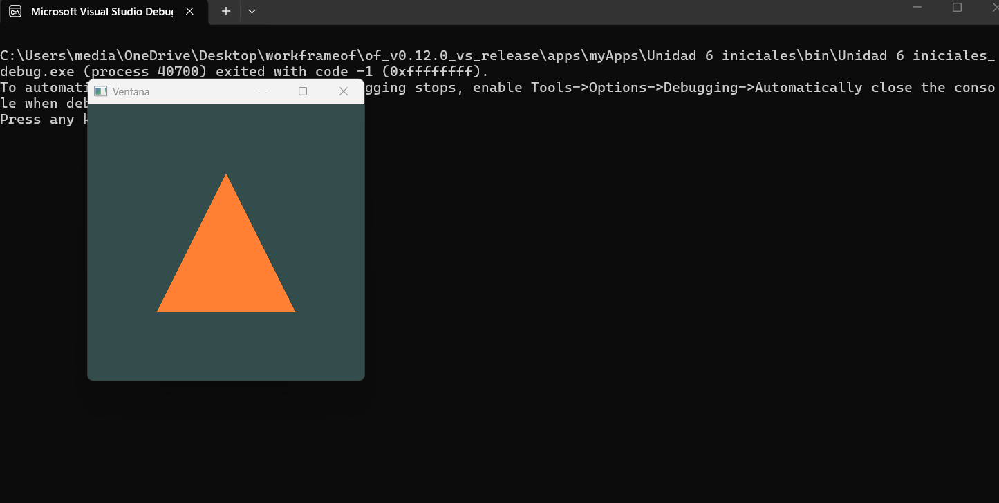

### Bitacora
Lo que entendí de todo esto es que cuando quiero usar OpenGL para dibujar cosas con la GPU, no puedo simplemente llamar las funciones así nomás, porque las funciones reales viven dentro de los **drivers de la GPU** y su ubicación en memoria cambia dependiendo del sistema. Entonces necesito algo que las busque por mí, y eso es **GLAD**. Cuando arranca el programa, GLAD le pregunta al driver dónde están todas esas funciones modernas como `glDrawArrays` o `glCreateShader`, y las guarda para que yo pueda usarlas. Sin GLAD, OpenGL moderno simplemente no corre.

Ahora, **opengl32.lib** es la biblioteca de Windows que sirve de puente para arrancar todo ese proceso. El problema es que solo conoce OpenGL 1.1, que es antiquísimo. O sea, la necesito para que compile y enlace, pero todo lo interesante del OpenGL moderno me lo da GLAD hablando directamente con el driver.

Pero aunque ya tenga acceso a la GPU, todavía necesito un lugar donde dibujar. Ahí entra **GLFW**: él se encarga de crear la ventana del sistema operativo, de inicializar el contexto de OpenGL dentro de esa ventana, y además me maneja el teclado y el mouse. Sin GLFW tendría que hacer todo eso yo mismo para cada sistema operativo, lo cual sería una pesadilla.

Y por último está **GLM**, que es la librería de matemáticas. OpenGL no calcula nada por mí, yo tengo que pasarle los números ya listos. Entonces GLM me da vectores, matrices, y funciones para rotar, mover y escalar objetos, además de armar las matrices de cámara y proyección. Sin GLM tendría que hacer toda esa álgebra lineal a mano.

En resumen: GLFW me da la ventana, GLAD encuentra las funciones del driver, opengl32.lib conecta todo en Windows, y GLM me ayuda a calcular las matemáticas que le paso a la GPU. Todos dependen del otro para que el programa funcione.

---

### Preguntas

- ¿Por qué hay que llamar `glfwMakeContextCurrent` *antes* de cargar GLAD? ¿Qué pasa si lo hago al revés?

- Entiendo que el VAO y el VBO son cosas distintas, pero no tengo claro la diferencia. ¿El VBO guarda los vértices y el VAO le dice a OpenGL cómo leerlos? ¿O el VAO también guarda datos?

- En `glVertexAttribPointer` hay un montón de parámetros, especialmente ese último que es `(void*)0`. ¿Eso es un offset? ¿Para qué sirve y cuándo dejaría de ser cero?

- ¿Por qué después de compilar y linkear los shaders los borro con `glDeleteShader`? ¿No los voy a necesitar después?

- En el vertex shader, `gl_Position` recibe un `vec4` pero mis vértices son `vec3`. ¿Por qué OpenGL necesita 4 componentes para una posición 3D? ¿Qué es ese último valor `1.0` que le paso?
