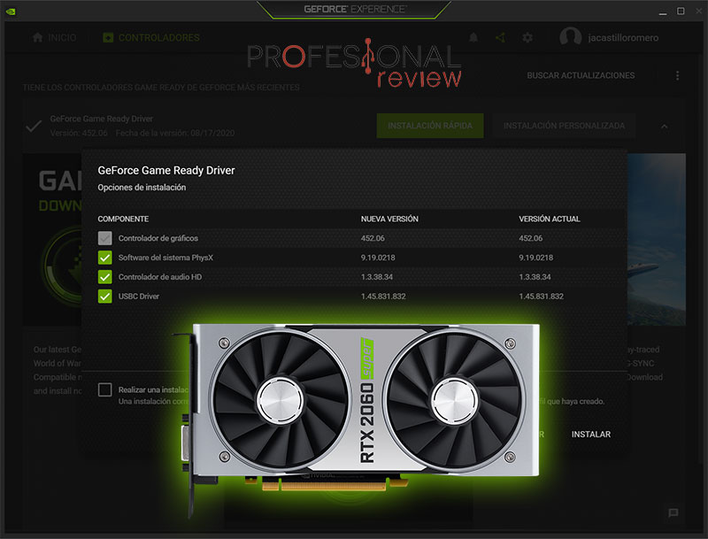
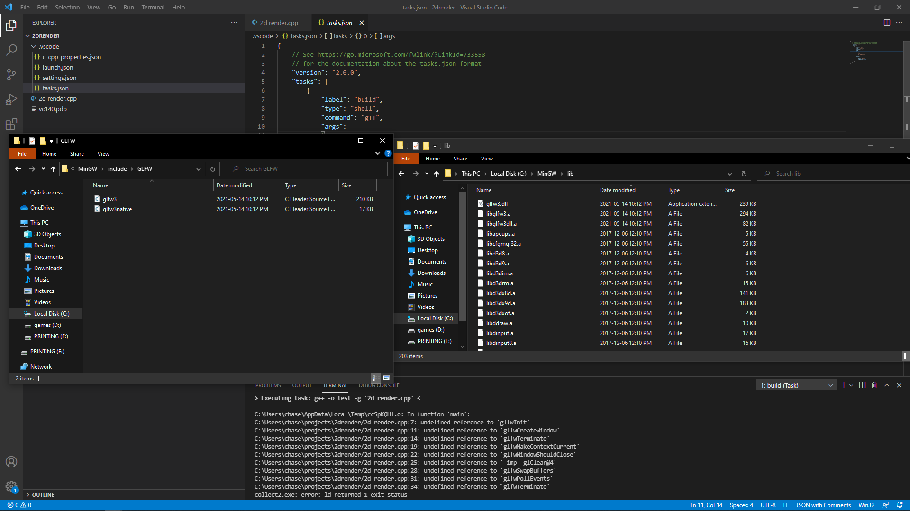
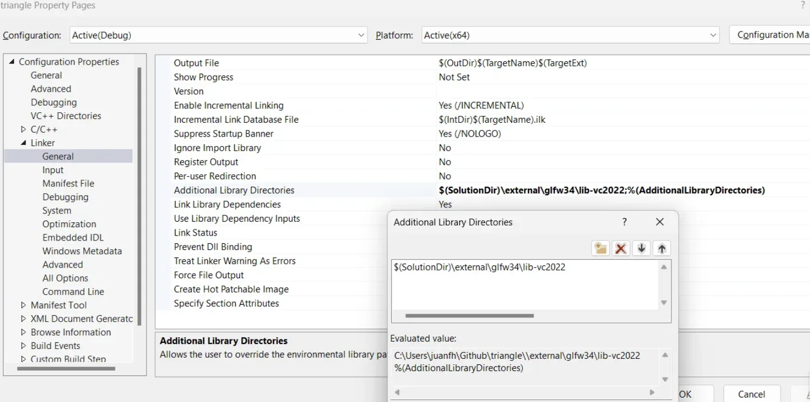
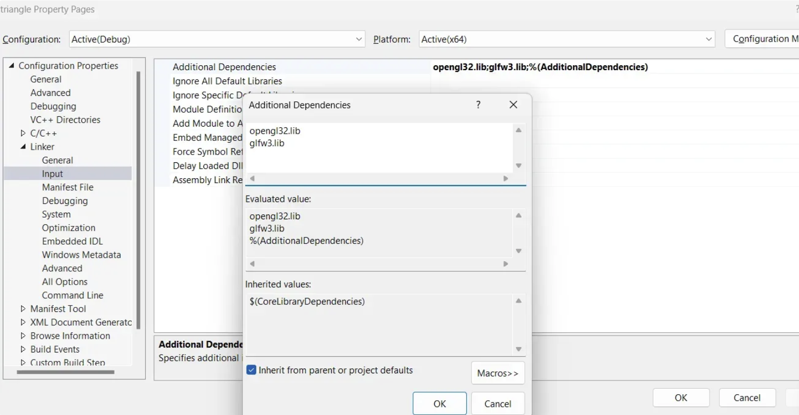

### Bitacora
 Imaginemos que la GPU es como una máquina muy poderosa que sabe dibujar cosas, pero para hablar con ella necesitas hablar su idioma. Ese idioma es OpenGL, y las funciones de ese idioma viven dentro de los **drivers de la GPU**, o sea, el software que instala NVIDIA, AMD o Intel cuando conectas tu tarjeta gráfica. El problema es que esas funciones no están en un lugar fijo, cambian dependiendo del driver y del sistema, así que no puedo simplemente llamarlas desde mi código como si fueran funciones normales.

Para eso existe **GLAD**. Lo que hace GLAD es, al momento de arrancar el programa, preguntarle al driver: "oye, ¿dónde está `glDrawArrays`? ¿dónde está `glCreateShader`?" y guarda esas direcciones para que yo pueda usarlas. Sin GLAD, todo ese OpenGL moderno no funciona, punto.

Ahora, **opengl32.lib** es una biblioteca que viene con Windows y que necesito para que el proyecto compile y enlace. El detalle es que solo conoce OpenGL 1.1, que tiene como 30 años. Entonces la uso como base para que todo arranque, pero lo que realmente me da acceso a las funciones modernas es GLAD hablando con el driver.

Pero con todo eso todavía me falta algo: ¿dónde dibujo? Necesito una ventana. Ahí entra **GLFW**, que se encarga de crear la ventana del sistema operativo, inicializar el contexto de OpenGL dentro de ella, y manejar eventos como el teclado y el mouse. Sin GLFW tendría que hacer todo eso a mano para Windows, Linux y Mac por separado, lo cual sería un caos.

Y finalmente está **GLM**. OpenGL no hace matemáticas por mí, yo tengo que pasarle los números ya calculados. GLM es una librería de álgebra lineal que me da vectores, matrices, y funciones para rotar, mover y escalar objetos en el espacio 3D, además de construir las matrices de cámara y proyección. Sin GLM tendría que hacer todo eso a mano.

Conectando todo: GLFW crea la ventana y el contexto, GLAD busca las funciones del driver una vez que el contexto existe, opengl32.lib es el puente base de Windows para que todo eso compile, y GLM me ayuda a preparar las matemáticas que le mando a la GPU. Cada uno tiene su rol y sin alguno de ellos el sistema no funciona.

**Pasos que seguí para desarrollar la actividad 2**

1. Le entregué a visual los archivos principales.

2. Le entregué la única librería que tenía ya que los demás archivos eran de código fuente

3. Le dije a visual que librerías quería usar y para finalizar me aseguré que un documento extra también estaba en la carpeta del proyecto 

