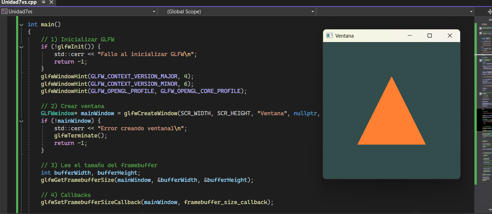
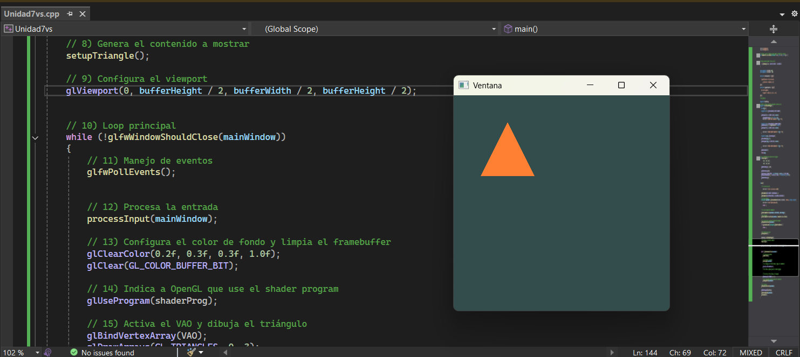

# Bitacora 1
Imágen del triángulo antes del experimento

Imágen del triángulo después del experimento

## Respuestas

**¿Qué pasa con `glViewport(0, bufferHeight/2, bufferWidth/2, bufferHeight/2)`?**

La escena se mete entera en el cuadrante de arriba a la izquierda de la ventana. El resto queda con el color de fondo.

**¿Qué pasa al dividir `bufferWidth` y `bufferHeight` (por 2, por 4)?**

La escena se hace más chiquita y se pega a la esquina inferior izquierda. Entre más grande el divisor, más pequeña se ve.

**¿Qué pasa al multiplicar (por 2, por 4)?**

Se ve como un zoom: el modelo se hace enorme y solo alcanzo a ver una esquina, porque el rectángulo donde OpenGL dibuja ahora es más grande que la ventana y lo demás se sale.

**¿Qué creo que está pasando?**

`glViewport` no recorta la escena, la **estira o encoge** para meterla en el rectángulo que yo le diga. Si el rectángulo es chico, la escena se ve chica; si es más grande que la ventana, solo veo un pedazo porque el resto cae fuera.

**Pensé que el framebuffer cambiaba pero no. El framebuffer (la ventana real) sigue igual. Lo único que cambia es el rectángulo dentro de él donde OpenGL está pintando.**

# Bitacora 2
Hoy entendí cómo funciona realmente la base de OpenGL y ya no lo veo como “magia”, sino como un sistema bien organizado donde cada parte tiene un rol claro.

Primero, tengo claro que todo empieza con varias herramientas que trabajan juntas. GLFW es quien crea la ventana y el contexto, o sea, prepara el “espacio de trabajo”. opengl32.lib permite que OpenGL pueda inicializarse en el sistema. GLAD se encarga de cargar las funciones modernas las funciones salen de los drivers de la gpu, de OpenGL para poder usarlas correctamente según mi GPU, y GLM me ayuda con las matemáticas, especialmente cuando más adelante tenga que hacer transformaciones o animaciones.

Después entendí algo clave: el contexto OpenGL. Antes no tenía claro qué era, pero ahora lo veo como ese entorno donde vive todo lo que usa OpenGL. Ahí se guarda el estado, los recursos como buffers o shaders, y además está conectado directamente con la ventana donde voy a dibujar. Sin ese contexto, literalmente OpenGL no puede hacer nada.

También me quedó claro que OpenGL no dibuja directamente. Yo le doy instrucciones usando código, OpenGL las traduce, y la GPU es la que realmente hace el trabajo pesado y dibuja en el framebuffer. El framebuffer lo entendí como una especie de “hoja invisible” donde se construye cada imagen antes de mostrarse en pantalla.

Otra cosa importante fue entender el inicio del programa: primero se inicializa GLFW, luego se configura la versión de OpenGL que quiero usar, después se crea la ventana junto con su contexto. Luego hago ese contexto actual con glfwMakeContextCurrent, porque si no hago eso, OpenGL no sabe dónde aplicar las instrucciones.

También entendí lo del framebuffer size, que no siempre coincide con el tamaño de la ventana por temas de pantallas con alta densidad de píxeles. Y el viewport, que básicamente define qué parte de ese framebuffer voy a usar para dibujar. Si eso está mal configurado, todo se puede ver raro o deformado.

En general, siento que ahora entiendo mejor el flujo:
yo escribo código → OpenGL interpreta → GPU ejecuta → framebuffer guarda → pantalla muestra.

**Experimento – ¿Qué pasaría si...?**

¿Qué pasaría si no llamo a glfwMakeContextCurrent?

Pienso que OpenGL no tendría un contexto activo, entonces cualquier función que intente usar no sabría a qué ventana o espacio aplicar los cambios. Probablemente el programa no dibujaría nada o incluso daría errores. Sería como intentar pintar sin tener un lienzo seleccionado.

Otro experimento: ¿qué pasaría si el viewport no coincide con el tamaño del framebuffer?

Creo que el dibujo se vería estirado, recortado o en una esquina de la pantalla, porque OpenGL estaría dibujando en un área distinta a la que realmente se muestra.

Esto me ayuda a entender que no es solo escribir código, sino que todo tiene que estar bien conectado para que funcione correctamente.

#   Bitacora 3
### 1. ¿Qué es el contexto OpenGL?

El contexto OpenGL es como el "espacio de trabajo" donde OpenGL guarda todo lo que está pasando en ese momento: qué shaders estoy usando, qué buffers tengo cargados, qué color de fondo puse, qué versión de OpenGL estoy corriendo, etc. Sin contexto, las funciones de OpenGL no tienen dónde "vivir" ni a quién hablarle. Es el puente entre mi código y la GPU.

### 2. ¿Cuál es el rol de GLFW y qué ventaja tiene usarla?

GLFW se encarga de crear la ventana, manejar el teclado y el mouse, y además crea el contexto OpenGL por mí. La ventaja grande es que es multiplataforma: el mismo código me sirve en Windows, Linux o Mac, sin tener que escribir cosas distintas para cada sistema operativo. Me ahorra un montón de trabajo sucio.

### 3. ¿Por qué OpenGL necesita un contexto? (analogía del taller)

Porque OpenGL es como el artista, pero el artista no puede pintar al aire: necesita un taller con sus herramientas, sus pinceles, sus pinturas y su lienzo. El contexto es ese taller. Ahí están todos los recursos y el estado que necesita para poder dibujar. Sin taller, no hay cómo trabajar.

### 4. ¿Qué es el framebuffer y a qué me recuerda?

El framebuffer es una zona de memoria (en la GPU) donde se va pintando la imagen antes de mostrarla en pantalla. Es como una hoja invisible donde la GPU pinta el cuadro completo y, cuando termina, lo muestra. Me recuerda al concepto de buffer que vimos antes en el curso: una zona de memoria intermedia donde guardamos datos antes de mostrarlos o procesarlos. Es la misma idea pero aplicada a píxeles.

### 5. ¿Qué relación hay entre el viewport y el framebuffer?

El framebuffer es toda la hoja donde se puede pintar. El viewport es el rectángulo dentro de esa hoja donde realmente le digo a OpenGL que pinte. Normalmente el viewport ocupa todo el framebuffer, pero como vi en el experimento anterior, puedo hacerlo más chico, más grande o ponerlo en cualquier esquina. El viewport "vive dentro" del framebuffer.

### 6. ¿Qué rol juegan los drivers de la GPU y la GPU misma?

La GPU es la que de verdad hace el trabajo: ejecuta los shaders, pinta los píxeles, hace los cálculos en paralelo. Los drivers son el software que sabe hablar con esa GPU específica, son los que tienen el código real de las funciones modernas de OpenGL. Cuando yo llamo una función de OpenGL, en últimas estoy mandándole una instrucción a la GPU a través del driver. GLAD es el que me ayuda a conectarme con esas funciones que están en el driver.

### 7. ¿Por qué activar VSync?

VSync sincroniza la velocidad a la que dibujo con la velocidad del monitor (por ejemplo, 60 FPS si el monitor es de 60 Hz). Si no lo activo:

- **Imagen estática:** no se nota mucho, porque igual no hay movimiento. La GPU va a estar dibujando lo mismo a toda velocidad y gastando energía al pedo.
- **Imagen dinámica:** ahí sí se ve feo. Aparece el *tearing*, que es cuando la pantalla muestra "media imagen vieja y media imagen nueva" porque la GPU dibujó más rápido que lo que el monitor alcanzó a mostrar. Se ve como un corte horizontal en la imagen.

### 8. ¿Qué es OpenGL Legacy y en qué se diferencia del moderno?

OpenGL Legacy es la forma vieja de usar OpenGL, donde uno dibujaba con cosas como `glBegin()` y `glEnd()`, mandando vértices uno por uno. Era más fácil de escribir pero muy lento y poco flexible. OpenGL moderno (el que estoy usando, perfil Core) obliga a usar shaders, VBOs y VAOs: uno manda los datos a la GPU una sola vez y escribe sus propios programitas (shaders) que dicen cómo procesarlos. Es más complicado al principio pero mucho más rápido y potente.

### 9. ¿Qué es el shader program y por qué importa?

El shader program es la unión del vertex shader y el fragment shader, ya compilados y enlazados, listos para que la GPU los ejecute. Importa porque en OpenGL moderno **no se puede dibujar sin shaders**: ellos son los que le dicen a la GPU cómo transformar los vértices y cómo pintar cada pixel. Sin shader program, OpenGL no sabe qué hacer con los datos que le mando.

### 10. ¿Qué hace `setupTriangle()`? ¿Qué son el VAO y el VBO?

Intuitivamente, `setupTriangle()` agarra las posiciones de los tres vértices del triángulo y las sube a la GPU para que queden ahí guardadas, listas para dibujar.

- **VBO (Vertex Buffer Object):** es el buffer donde están los datos crudos de los vértices (las coordenadas) ya cargados en la GPU.
- **VAO (Vertex Array Object):** es como una "receta" o configuración que dice *cómo* leer ese VBO: cuántos números por vértice, qué representan, etc. Cuando activo el VAO, OpenGL sabe de una vez cómo interpretar los datos.

### 11. ¿Es necesario activar el shader program y el VAO en cada frame?

Si solo voy a dibujar una cosa con un solo shader y un solo VAO, no es necesario, lo podría dejar activado antes del game loop y listo. Pero se vuelve útil hacerlo en cada frame cuando tengo varias cosas para dibujar: por ejemplo, un triángulo con un shader y un cuadrado con otro, o varios objetos con distintos VAOs. Ahí toca ir cambiando antes de cada `glDrawArrays` para decirle a OpenGL qué usar para cada uno.

### 12. ¿Por qué es importante `glfwSwapBuffers(mainWindow)`?

`glfwSwapBuffers` intercambia el buffer donde estuve dibujando (el de atrás) con el que se está mostrando en pantalla (el de adelante). Es el momento en el que el cuadro que acabo de pintar realmente aparece en la ventana.

Si no lo llamo, lo que pasa es que **nunca veo lo que dibujé**: la GPU sí está pintando en el framebuffer trasero, pero la pantalla sigue mostrando el buffer delantero que quedó vacío (o con basura de memoria). Probándolo, la ventana se queda en negro o congelada aunque el programa esté corriendo perfectamente.

Es la idea del *doble buffering*: dibujo en privado en el de atrás y, cuando ya está listo el cuadro completo, lo "muestro" de un solo golpe. Si no hago el swap, el cuadro queda atrapado del lado invisible.