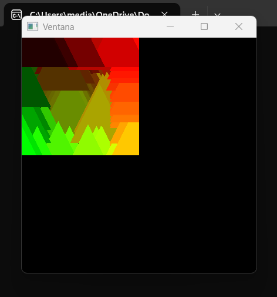
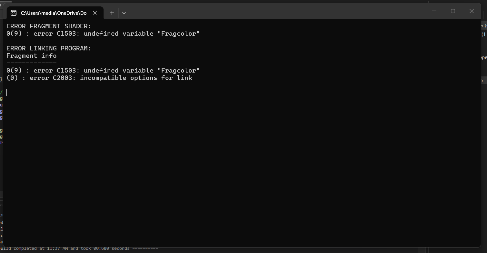
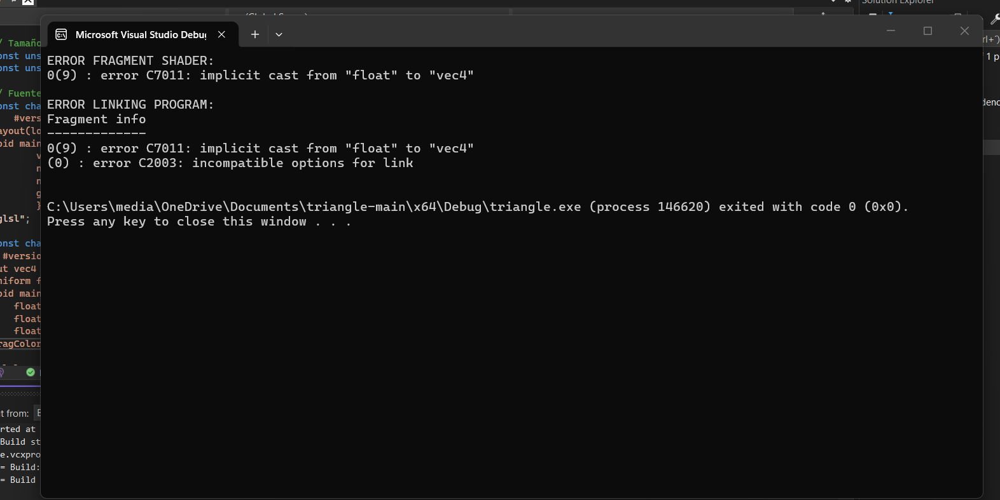

# Bitácora — Actividad 06

## 1. Cambios realizados en el código C++

Para que el triángulo cambie de color cíclicamente con el tiempo, hice tres modificaciones puntuales sobre el código de la actividad anterior, manteniendo intacta la estructura general:

- **Obtención de la location del uniform (una sola vez, antes del loop principal):** reemplacé la línea que obtenía la location del antiguo uniform `ourColor` por una que obtiene la del nuevo uniform `time`:

```cpp
  int timeLocation = glGetUniformLocation(shaderProg, "time");
```

  Esto se hace fuera del loop porque la dirección del uniform dentro del shader no cambia entre frames; basta con pedirla una vez y guardarla.

- **Obtención del tiempo y envío al shader (cada frame, dentro del loop):** dentro del `while (!glfwWindowShouldClose(mainWindow))`, eliminé las líneas que enviaban el color basado en la posición del mouse y las reemplacé por:

```cpp
  float timeValue = (float)glfwGetTime();
  glUniform1f(timeLocation, timeValue);
```

  `glfwGetTime()` devuelve los segundos transcurridos desde que se inicializó GLFW (como `double`), por eso lo casteé a `float` para que coincida con el tipo del uniform en el shader. La llamada `glUniform1f` envía ese valor a la GPU en cada iteración del loop, garantizando que el shader siempre reciba el tiempo actualizado.

- **Lo que se conservó:** el uniform `offset` y el cálculo de la posición del mouse se dejaron intactos, de modo que el triángulo sigue al cursor en posición pero su color depende únicamente del tiempo, como pedía la actividad.

## 2. Código modificado del fragment shader

```glsl
#version 460 core
out vec4 FragColor;
uniform float time;
void main() {
    float r = (sin(time)       + 1.0) / 2.0;
    float g = (sin(time + 2.0) + 1.0) / 2.0;
    float b = (sin(time + 4.0) + 1.0) / 2.0;
    FragColor = vec4(r, g, b, 1.0);
}
```

Se eliminó el uniform `ourColor` (color fijo basado en el mouse) y se reemplazó por `uniform float time`, que es el que utilizan los cálculos de R, G y B.

## 3. Uso de la función de tiempo y rango de valores

Para generar el ciclo de colores usé la función trigonométrica `sin()`, que es ideal porque es **periódica y suave**: oscila continuamente sin saltos bruscos, y un ciclo completo se repite cada `2π ≈ 6.28` segundos.

El detalle importante está en el rango de valores:

- **`sin(time)`** por sí solo produce valores en el intervalo `[-1, 1]`.
- Pero los canales de color en OpenGL deben estar en el intervalo `[0, 1]` (`0.0` = canal apagado, `1.0` = canal al máximo). Si pasara directamente un valor negativo, GLSL lo recortaría a 0 y perdería la mitad del ciclo.
- Por eso aplico la transformación `(sin(time) + 1.0) / 2.0`:
  - Sumar `1.0` desplaza el rango de `[-1, 1]` a `[0, 2]`.
  - Dividir entre `2.0` lo comprime a `[0, 1]`, que es justo el rango válido para un componente de color.

Aplico la misma fórmula a los tres canales (R, G y B), pero con **desfases** de 0, 2 y 4 radianes en el argumento del seno. Si los tres canales oscilaran sincronizados, el resultado serían solo tonos de gris pulsando entre negro y blanco. Al desfasarlos, cada canal alcanza su máximo en un momento distinto del ciclo, lo que produce **transiciones continuas entre colores** (rojizos, amarillentos, verdes, cian, azules, magentas) en lugar de un simple parpadeo monocromático. El efecto final es un triángulo que cambia suavemente de color completando un ciclo cromático completo cada ~6.28 segundos.

## 4. Captura 




*(Aquí adjunto la captura del triángulo ejecutándose, mostrando cómo el color cambia de forma continua mientras el triángulo sigue al mouse.)*

## 5. Reflexión: otros efectos posibles usando el tiempo como uniform

Una vez que se entiende el patrón de enviar `time` al shader y usarlo con funciones trigonométricas, se abre la puerta a muchos otros efectos. Algunas ideas:

- **Oscilación de posición (efecto péndulo):** en el vertex shader, sumar `sin(time)` al componente X del offset para que el triángulo se mueva horizontalmente de un lado a otro de forma continua, como un péndulo. Sería tan simple como `newPos.x += sin(time) * 0.5;`.

- **Efecto de respiración (escalado):** multiplicar `aPos` por un factor que dependa del tiempo, por ejemplo `aPos * (1.0 + sin(time) * 0.2)`, haría que el triángulo crezca y se encoja rítmicamente, como si estuviera "respirando".

- **Rotación sobre el centro:** aunque no hemos visto matrices formalmente, intuitivamente se podría aplicar en el vertex shader una rotación 2D usando `cos(time)` y `sin(time)` sobre las coordenadas `xy` del vértice, de modo que el triángulo gire continuamente sobre su propio eje. La idea es que un punto `(x, y)` rotado un ángulo `θ` queda en `(x·cos θ − y·sin θ, x·sin θ + y·cos θ)`, y usando `time` como ángulo se obtiene una rotación constante en el tiempo.

La idea clave es que el tiempo, al ser un valor que crece monótonamente, sirve como **"motor" universal de animación**: cualquier propiedad visual (color, posición, tamaño, rotación, transparencia) puede convertirse en algo dinámico simplemente haciéndola depender de `time` mediante funciones matemáticas adecuadas.

### Errores


En este primer error no estaba llamando al vector qque creé y tampoco le di opacidad.


La parte de la gpu estaba bien, pero no había ninguna parte del código que le enviara los datos.