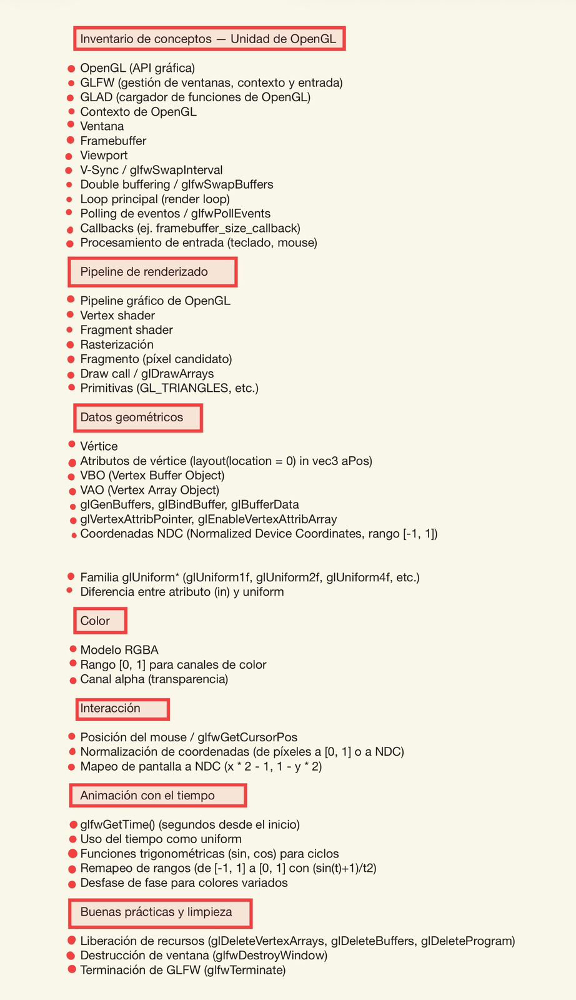

## 1. Conceptos que se me guardaron

## 2. Conceptos que domino bien vs. los que me cuestan más
Domino bien:

El flujo general de un programa OpenGL (inicializar GLFW, crear ventana, cargar GLAD, loop, limpieza). Tener esa estructura clara me permite ubicar cualquier código nuevo en su lugar correcto.
El uso de uniforms: ya entiendo la diferencia entre obtener la location una sola vez con glGetUniformLocation y enviar el valor cada frame con glUniform*, y por qué no se hace al revés.
La comunicación entre CPU y GPU mediante uniforms y el papel del tiempo como motor de animación.
La transformación de rangos ([-1, 1] → [0, 1]) para usar sin() en colores, y el por qué de esa fórmula.

Me cuestan más trabajo:

La diferencia precisa entre VAO y VBO, qué guarda exactamente cada uno y por qué hay que bindearlos en cierto orden.
El sistema de coordenadas NDC y la conversión entre coordenadas de pantalla, coordenadas normalizadas y NDC (especialmente recordar por qué Y se invierte en la fórmula 1 - y*2).
Las matrices de transformación (rotación, escalado, traslación), que todavía no he visto formalmente pero ya intuyo que serán claves para animaciones más complejas.
El manejo de errores en la compilación de shaders: entiendo qué hace el código pero todavía me costaría depurar un shader cuando algo falla.

## 3. ¿Para qué pueden servirme estos conceptos?
Más allá de la actividad puntual, estos conceptos son la base de varias cosas que me interesan:

Desarrollo de videojuegos y motores gráficos: cualquier engine moderno (Unity, Unreal, Godot) por debajo usa los mismos principios de pipeline, shaders y uniforms.
Visualización de datos en tiempo real: dashboards interactivos, gráficos científicos, simulaciones.
Gráficos generativos y arte digital: efectos visuales basados en shaders, como los que se ven en ShaderToy.
Simulaciones físicas y científicas: aprovechar la GPU para cálculos paralelos masivos.
Aplicaciones de realidad virtual y aumentada, donde el rendimiento gráfico es crítico.
A nivel más general, me da una mejor comprensión de cómo funciona realmente lo que veo en pantalla todos los días, y me prepara para entender APIs más modernas como Vulkan o WebGPU.

## 4. ¿Qué hice bien que debo continuar haciendo?

Mantener una estructura ordenada y comentada en el código, con secciones numeradas que indican qué hace cada bloque. Eso me ayuda a volver al código después de días y entender rápido qué está pasando.
Hacer cambios mínimos y controlados cuando modifico el código, en lugar de reescribir todo desde cero. Eso me permite aislar qué línea produjo cada efecto y aprender realmente del cambio.
Preguntar el "por qué" detrás de cada función y no solo copiar código. Entender por qué glUniform* va dentro del loop y glGetUniformLocation va fuera, por ejemplo, me dio una comprensión que va más allá de la actividad.
Probar con valores distintos (cambiar desfases, fórmulas, factores) para ver cómo afecta el resultado visual. Esa experimentación consolida más que solo leer.

## 5. ¿Qué debería empezar a hacer para mejorar?

Dibujar diagramas a mano del pipeline y del flujo de datos antes de escribir código nuevo. Visualizar el camino que recorre un vértice desde el VBO hasta el píxel final me ayudaría a tener todo más claro.
Llevar un glosario personal con cada función nueva de OpenGL/GLFW que uso, escribiendo con mis propias palabras qué hace, qué parámetros recibe y por qué se llama en ese momento del programa.
Hacer pequeños experimentos extra después de cada actividad: tomar el código terminado y modificar una sola cosa para ver cómo reacciona (cambiar el color base, agregar otro triángulo, mover los vértices). Esto refuerza lo aprendido sin la presión de una entrega.
Leer la documentación oficial (docs.gl, learnopengl.com) en lugar de quedarme solo con lo visto en clase, especialmente para los conceptos que me cuestan más.
Verbalizar o explicar en voz alta (a un compañero o incluso a mí mismo) lo que hace cada parte del código. Si no puedo explicarlo, es señal de que no lo entiendo del todo.

## 6. Plan de acción personal
Para atacar específicamente los conceptos que me cuestan más (VAO/VBO, coordenadas y matrices), me propongo:
Corto plazo (esta semana):

Hacer un diagrama propio explicando paso a paso qué hace cada línea de setupTriangle(), incluyendo qué guarda el VAO, qué guarda el VBO y cómo se conectan mediante glVertexAttribPointer.
Modificar el triángulo de la actividad para que tenga cuatro vértices formando un cuadrado (con dos triángulos), forzándome a manipular el VBO con más datos.
Escribir en mi bitácora, con mis propias palabras, la diferencia entre coordenadas de pantalla, normalizadas [0,1] y NDC [-1,1].

Mediano plazo (próximas dos semanas):

Implementar al menos uno de los efectos que mencioné en la reflexión (oscilación de posición, escalado pulsante o rotación) usando el tiempo como uniform.
Leer el capítulo de "Transformations" de learnopengl.com para entender formalmente las matrices de rotación, traslación y escalado, antes de que las veamos en clase.
Repetir mentalmente el flujo completo del pipeline cada vez que abra un proyecto: "GLFW crea la ventana, GLAD carga las funciones, los shaders se compilan, el VAO/VBO suben los datos, el loop dibuja frame por frame, los uniforms actualizan los valores variables".

### Hábito permanente:

Antes de pedir ayuda con un error, intentar explicarlo en voz alta durante al menos cinco minutos. Muchas veces ese ejercicio basta para encontrar la solución, y cuando no, al menos llego con una pregunta mucho más precisa.
Mantener un archivo de "experimentos" aparte del código de las entregas, donde pueda romper cosas libremente y aprender de los errores sin miedo a dañar la tarea.